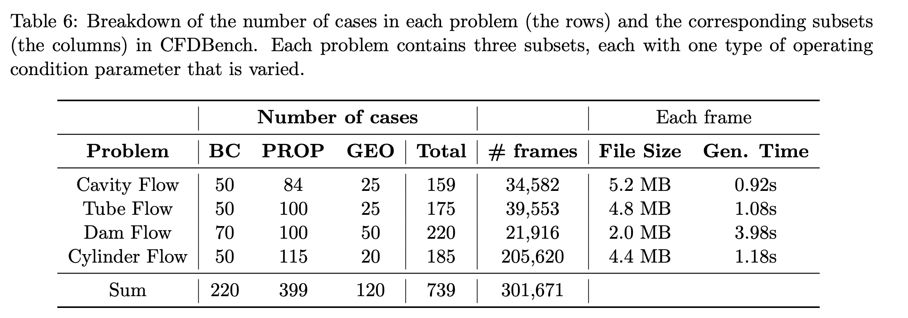

# CFDBench

CFDBench is not a collection of four unrelated PDE systems. It instantiates a common two-dimensional incompressible Navier--Stokes family in four representative CFD configurations: a lid-driven cavity, a two-phase tube flow, a gravity-driven flow over an obstacle, and flow around a cylinder. Each configuration is further split into BC, PROP, and GEO base subsets.




## Configurations

| Problem configuration | Physical character | Trajectories | Frames |
|---|---|---:|---:|
| [Cavity Flow](./cavity_flow/) | Single phase, closed cavity, moving wall | 159 | 34,582 |
| [Tube Flow](./tube_flow/) | Water--air, inlet boundary layer | 175 | 39,553 |
| [Dam Flow](./dam_flow/) | Two phase, gravity, obstacle and jet | 220 | 21,916 |
| [Cylinder Flow](./cylinder_flow/) | Bluff-body wake and vortex shedding | 185 | 205,620 |
| **Total** | — | **739** | **301,671** |

## Shared data facts

- Every problem has three mutually generated subsets: `bc`, `prop`, and `geo`. They are not a full Cartesian product over all parameters.
- The paper reports 739 cases/trajectories and 301,671 frames.
- The official interpolated release stores the two velocity components in `u.npy` and `v.npy`; trajectory length $T_i$ is not necessarily constant.
- Results are interpolated to $64\times64$. Current loaders additionally construct masks and may pad boundary grid lines for Tube and Dam.
- Although the abstract mentions velocity and pressure fields, the official interpolated archives and baseline loaders consistently use `u.npy` and `v.npy`. Pressure is available in raw Fluent exports and requires user-side parsing and interpolation.
- The Hugging Face data card is marked Apache-2.0; the paper and code should still be cited.

## Source-priority rule

When the paper, appendix, code, and download disagree, use the following order for an actual training pipeline:

1. the downloaded `case.json` and `u.npy/v.npy.shape`;
2. the loader at a fixed commit;
3. the main paper text;
4. paper tables or code comments.

This avoids propagating known conflicts in Tube GEO, Dam PROP/GEO, Cylinder `d` versus `radius`, and time-step metadata.

## Download and directory layout

### Official links

- Paper: [https://arxiv.org/abs/2310.05963](https://arxiv.org/abs/2310.05963)
- Official code: [https://github.com/luo-yining/CFDBench](https://github.com/luo-yining/CFDBench)
- Interpolated data: [https://huggingface.co/datasets/chen-yingfa/CFDBench](https://huggingface.co/datasets/chen-yingfa/CFDBench)
- Raw Fluent data: [https://huggingface.co/datasets/chen-yingfa/CFDBench-raw](https://huggingface.co/datasets/chen-yingfa/CFDBench-raw)
- Baidu Drive mirror for raw data: [https://pan.baidu.com/s/1p0q60cv2hFZ7UcIf3XKSaw?pwd=cfd4](https://pan.baidu.com/s/1p0q60cv2hFZ7UcIf3XKSaw?pwd=cfd4), extraction code `cfd4`

The repository README describes the interpolated release as approximately 13.4 GB; the Hugging Face page reported approximately 14.4 GB on **2026-07-21**. The README describes the complete raw data as approximately 460 GB, while the current raw Hugging Face page reports about 205 GB and notes that parts of Cylinder are still being uploaded. Reproducible work should record the download date and repository revision.

### Command-line download

Install the current Hugging Face CLI:

```bash
python -m pip install -U huggingface_hub
```

Download the complete interpolated repository:

```bash
hf download chen-yingfa/CFDBench \
  --repo-type dataset \
  --local-dir ./downloads/CFDBench
```

The complete raw repository can require hundreds of gigabytes. Inspect it first:

```bash
hf download chen-yingfa/CFDBench-raw \
  --repo-type dataset \
  --local-dir ./downloads/CFDBench-raw \
  --dry-run
```

### Code repository

```bash
git clone https://github.com/luo-yining/CFDBench.git
cd CFDBench
python -m pip install -r requirements.txt
```

Recommended extracted layout:

```text
data/
├── cavity/
│   ├── bc/caseXXXX/{case.json,u.npy,v.npy}
│   ├── geo/caseXXXX/{case.json,u.npy,v.npy}
│   └── prop/caseXXXX/{case.json,u.npy,v.npy}
├── tube/
├── dam/
└── cylinder/
```

## Provenance

- Paper v2, Section 3, Tables 2--6, and Appendix E.1.
- Official repository README, `src/dataset/*.py`, and `generation-code/`.
- Official Hugging Face interpolated and raw repositories.
