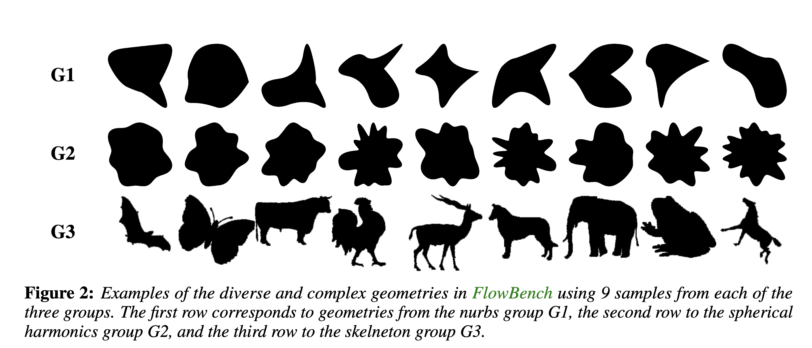
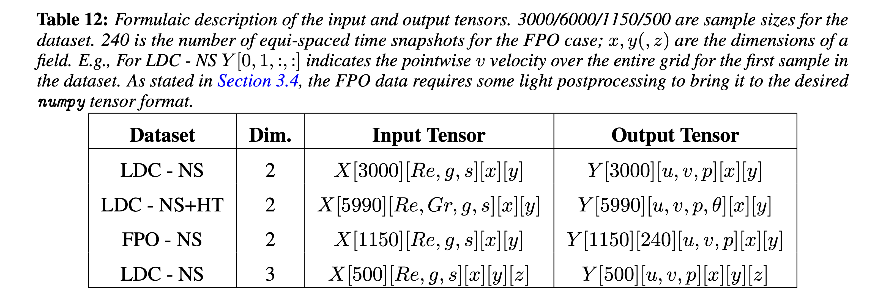

# FlowBench

## Configurations

| Configuration | PDE / notes | Dimension | Regime | Nominal/current samples | Hosted size |
|---|---|---:|---|---:|---:|
| [LDC NS 2D](./01_ldc_ns_2d/) | LDC, incompressible NS | 2-D | steady | 3000 | 28.3 GB |
| [LDC NSHT 2D (constant Re)](./02_ldc_nsht_2d_constant_re/) | LDC, NS + heat, constant Re | 2-D | steady | 2990 | 34.5 GB |
| [LDC NSHT 2D (variable Re)](./03_ldc_nsht_2d_variable_re/) | LDC, NS + heat, variable Re | 2-D | steady | 3000 | 34.6 GB |
| [FPO NS 2D](./04_fpo_ns_2d/) | FPO, incompressible NS | 2-D | transient | nominal 1150; corrupted files removed | 1.59 TB |
| [LDC NS 3D](./05_ldc_ns_3d/) | LDC, incompressible NS | 3-D | steady | paper 500; current 1000 | 33.4 GB |

## FlowBench overview

- current official repository size: approximately **1.72 TB**;
- license: **CC-BY-NC-4.0**;
- paper: [FlowBench: A Large Scale Benchmark for Flow Simulation over Complex Geometries](https://arxiv.org/abs/2409.18032);
- data: [BGLab/FlowBench](https://huggingface.co/datasets/BGLab/FlowBench);
- tools: [flowbench-tools](https://github.com/baskargroup/flowbench-tools);
- training/evaluation: [GeometryMatters](https://github.com/baskargroup/GeometryMatters).

## Major cross-release differences

1. FPO: 240 frames in the paper table versus 242 raw frames in the current card/code, with the first two commonly ignored.
2. FPO: the $512\times128$ release was removed; $1024\times256$ remains.
3. 3-D LDC: 500 samples in the paper versus 1000 currently hosted.
4. 3-D output: the paper table omits $w$, while the official code reads $u,v,w,p$.
5. DataPrep may package $C_D,C_L,$ and $\mathrm{Nu}$ in auxiliary channels; these are not local PDE fields.
6. Paper semantics and some older scripts differ in mask/SDF sign or 0/1 versus 0/255 representation.
