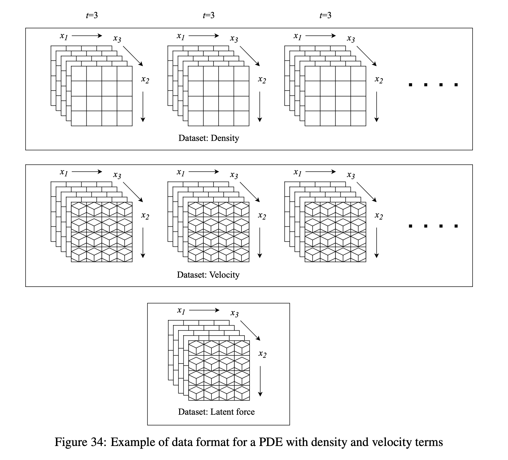

# Data format

This page follows the currently downloadable HDF5 files, official dataloaders / download manifest, and DaRUS dataset notes. Each equation card also lists the concrete files for that category.

The figure illustrates density (scalar time series), velocity (vector time series), and a latent force (optional time-invariant conditioning field) as separate HDF5 datasets. Not every PDE stores all three.

## Storage and naming

- Format: HDF5 (`.hdf5` / `.h5`).
- Naming: released filenames usually use underscores, e.g. `1D_Advection_Sols_beta0.4.hdf5` or `2D_diff-react_NA_NA.h5`; the authoritative list is `pdebench_data_urls.csv`.
- Each file typically contains one logical group with one or more datasets (tensors). Exact keys follow the generator and official dataloaders.
- Simulation parameters are stored as **YAML strings** in HDF5 attributes (UTF-8).

## Array layout

Shared convention:

\[
(b,\, t,\, x_1,\ldots,x_d,\, v)
\]

| Axis | Meaning |
|---|---|
| $b$ | samples / trajectories |
| $t$ | time (including the initial snapshot; trust the actual `shape`) |
| $x_1,\ldots,x_d$ | spatial axes (1D/2D/3D) |
| $v$ | state channels (1 for a scalar field; 2 for a 2D velocity, etc.) |

Not every axis is always present: time-invariant fields (some forces / Darcy coefficients) may omit $t$. Coordinate arrays commonly use `x-coordinate` / `y-coordinate` / `z-coordinate` (or `grid/x`, `grid/y` in incompressible-NS shards).

## Channels versus separate datasets

- Many scalar / few-channel tasks store the field in a `tensor` dataset with the layout above.
- **Compressible Navier–Stokes:** density, pressure and velocity components are often separate datasets (`density`, `pressure`, `Vx`, `Vy`, `Vz`) rather than a stacked channel axis $v`, enabling spatially subsampled I/O.
- **Incompressible NS:** velocity and (static) force may use separate keys; the `512` token in shard filenames must not be read as the grid resolution.

## Machine-learning use

A full HDF5 trajectory is not a fixed network input. Official training usually slices $\ell$ input frames and a one-step / multi-step target via `initial_step`. Loading examples live under [`pdebench/models`](https://github.com/pdebench/PDEBench/tree/main/pdebench/models) (e.g. FNO `utils.py` branches for `tensor` versus CFD keys).

## Download-manifest convention

Current one-click file lists follow [`pdebench/data_download/pdebench_data_urls.csv`](https://github.com/pdebench/PDEBench/blob/main/pdebench/data_download/pdebench_data_urls.csv). Each equation card lists relative paths and filenames for that category. After download, still verify `shape`, coordinates and attributes.

## Primary sources

- [Official PDEBench repository](https://github.com/pdebench/PDEBench)
- [Official download docs and URL manifest](https://github.com/pdebench/PDEBench/tree/main/pdebench/data_download)
- [PDEBench dataset DOI](https://doi.org/10.18419/darus-2986)
