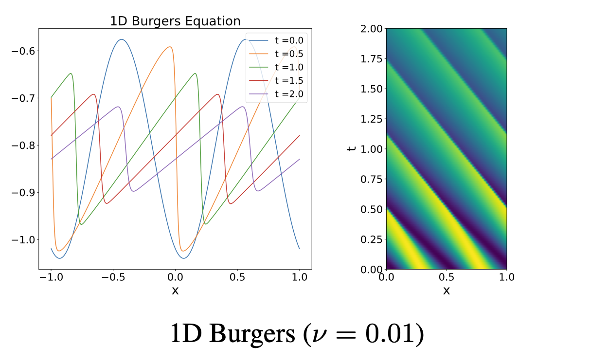

# 1D Burgers' Equation

Burgers’ equation combines nonlinear convection with diffusion and is a classic model of shock formation and viscous smoothing. The diffusion coefficient $\nu$ sets the balance between nonlinearity and diffusion: larger effective Reynolds number supports steep fronts, while smaller values are diffusion-dominated.



## Parent dataset and access

| Field | Value |
|---|---|
| Parent dataset | **PDEBench** |
| Dataset paper | [PDEBench: An Extensive Benchmark for Scientific Machine Learning](https://arxiv.org/abs/2210.07182) |
| Paper PDF | [arXiv PDF](https://arxiv.org/pdf/2210.07182) |
| Official repository | [pdebench/PDEBench](https://github.com/pdebench/PDEBench) |
| Dataset DOI / DaRUS | [10.18419/darus-2986](https://doi.org/10.18419/darus-2986) |
| Current download category | `burgers` |
| Data size | 93 GB |
| Data-generation entry point | [data_gen_NLE/BurgersEq](https://github.com/pdebench/PDEBench/tree/main/pdebench/data_gen/data_gen_NLE/BurgersEq) |
| Last checked | 2026-07-21 |

## Governing equation

\[
\partial_tu+\partial_x\!\left(\frac{u^2}{2}\right)=\frac{\nu}{\pi}\partial_{xx}u,
\qquad x\in(0,1),\quad t\in(0,2],
\]
\[
u(0,x)=u_0(x).
\]

## Variables and coordinates

**State variables**
- $u(t,x)$: scalar velocity / conserved variable.

**Parameters**
- $\nu$: diffusion coefficient in the paper; the coefficient multiplying $u_{xx}$ is $\nu/\pi$.
- Reynolds-number analogue: $R\equiv\pi u L/\nu$ ($R>1$ more nonlinear/shock-forming; $R<1$ more diffusive).

**Coordinates and domain**
- Space: uniform 1D Cartesian; the governing equation is written with $x\in(0,1)$.
- Time: $t\in(0,2]$.
- Note: appendix plots and some generator configs use $[-1,1]$; prefer HDF5 coordinates / YAML.

## About the data

| Attribute | Value |
|---|---|
| Spatial dim | 1 |
| Time-dependent | yes |
| Grid | uniform 1D Cartesian |
| Domain | formula $x\in(0,1)$; configs often $[-1,1]$ |
| Time range | $t\in[0,2]$ |
| Spatial res. | $N_x=1024$ |
| Time steps | 201 |
| Trajectories / file | 10,000 |
| Channels | 1: $u$ |
| Sample shape | $201\times1024\times1$ |
| Size | 93 GB |
| Format | HDF5 |

## Initial conditions

The same randomized sinusoidal-superposition family as the 1D advection dataset; wavenumbers, amplitudes, phases and seed vary.

## Boundary conditions

Periodic boundary conditions.

## Numerical generation

The nonlinear advective flux is discretized by a second-order upwind scheme; the diffusion term uses centered differences.

## Parameters

Equation:

\[
\partial_tu+\partial_x\!\left(\frac{u^2}{2}\right)=\frac{\nu}{\pi}\partial_{xx}u,
\qquad x\in(0,1),\quad t\in(0,2],
\]
\[
u(0,x)=u_0(x).
\]

### Released file configs

| Data file | $\nu$ | Boundary | Per trajectory | Fixed |
|---|---:|---|---|---|
| `1D_Burgers_Sols_Nu0.001.hdf5` | $0.001$ | periodic | IC $n_i,A_i,\phi_i$ | $N_x=1024$, $N_t=201$, domain $(0,1)\times[0,2]$ |
| `1D_Burgers_Sols_Nu0.002.hdf5` | $0.002$ | periodic | same | same |
| `1D_Burgers_Sols_Nu0.004.hdf5` | $0.004$ | periodic | same | same |
| `1D_Burgers_Sols_Nu0.01.hdf5` | $0.01$ | periodic | same | same |
| `1D_Burgers_Sols_Nu0.02.hdf5` | $0.02$ | periodic | same | same |
| `1D_Burgers_Sols_Nu0.04.hdf5` | $0.04$ | periodic | same | same |
| `1D_Burgers_Sols_Nu0.1.hdf5` | $0.1$ | periodic | same | same |
| `1D_Burgers_Sols_Nu0.2.hdf5` | $0.2$ | periodic | same | same |
| `1D_Burgers_Sols_Nu0.4.hdf5` | $0.4$ | periodic | same | same |
| `1D_Burgers_Sols_Nu1.0.hdf5` | $1.0$ | periodic | same | same |
| `1D_Burgers_Sols_Nu2.0.hdf5` | $2.0$ | periodic | same | same |
| `1D_Burgers_Sols_Nu4.0.hdf5` | $4.0$ | periodic | same | same |

10,000 trajectories per file. Paper Table 1 lists $N_t=200$; release is typically **201**.

### Generator-tunable ranges

| Parameter | Tunable range / options | Covered by release? |
|---|---|---|
| $\nu$ (viscosity) | any positive scalar (`multi/*.yaml`); more examples under `args/` | yes: the 12 values above |
| IC family / amplitude scale | editable (extra sin / possin templates) | no (default random-sine family) |
| BC, domain, grid, time | editable | release fixed |

## Data files

The current official download manifest (`pdebench_data_urls.csv`) lists **12** files; paths are relative to the download root. See [Data format](../00_data_format/).

- `1D/Burgers/Train/1D_Burgers_Sols_Nu0.001.hdf5`
- `1D/Burgers/Train/1D_Burgers_Sols_Nu0.01.hdf5`
- `1D/Burgers/Train/1D_Burgers_Sols_Nu0.1.hdf5`
- `1D/Burgers/Train/1D_Burgers_Sols_Nu0.002.hdf5`
- `1D/Burgers/Train/1D_Burgers_Sols_Nu0.02.hdf5`
- `1D/Burgers/Train/1D_Burgers_Sols_Nu0.2.hdf5`
- `1D/Burgers/Train/1D_Burgers_Sols_Nu0.004.hdf5`
- `1D/Burgers/Train/1D_Burgers_Sols_Nu0.04.hdf5`
- `1D/Burgers/Train/1D_Burgers_Sols_Nu0.4.hdf5`
- `1D/Burgers/Train/1D_Burgers_Sols_Nu1.0.hdf5`
- `1D/Burgers/Train/1D_Burgers_Sols_Nu2.0.hdf5`
- `1D/Burgers/Train/1D_Burgers_Sols_Nu4.0.hdf5`

## Data layout and machine-learning task

Scalar trajectory forecasting, either with one model per viscosity or with $\nu$ supplied as a conditioning variable.

- **Trajectory versus training example:** a complete HDF5 trajectory is not a fixed neural-network input. Autoregressive training normally extracts $\ell$ input frames and a one-step or multi-step target; $\ell$ is controlled by `initial_step` in the training configuration.
- **Source precedence:** equations, initial/boundary conditions and publication-scale statistics follow paper v7 and its supplement; current commands, paths and download categories follow the official GitHub `main` branch. Discrepancies are preserved rather than silently reconciled.

## Download

The current repository recommends `download_direct.py`; the EasyDataverse route is documented as slower and potentially error-prone.

```bash
git clone https://github.com/pdebench/PDEBench.git
cd PDEBench/pdebench/data_download
python download_direct.py --root_folder /path/to/pdebench_data --pde_name burgers
```

Files may also be selected manually from the [DaRUS DOI page](https://doi.org/10.18419/darus-2986). After downloading, inspect the actual HDF5 `shape`, coordinate arrays, variable keys and YAML attributes. In particular, do not infer CFD or incompressible-NS resolution solely from a filename.

## Regenerating from the official code

```bash
cd PDEBench/pdebench/data_gen/data_gen_NLE/BurgersEq
CUDA_VISIBLE_DEVICES=0 python3 burgers_multi_solution_Hydra.py +multi=1e-1.yaml
bash run_trainset.sh
cd ..
python Data_Merge.py
```

Generator parameters can be changed through the corresponding Hydra YAML. NLE generators first write `.npy` arrays; run `Data_Merge.py` to obtain the HDF5 layout used by the official dataloaders.

## What is interesting and challenging about the data

Low viscosity creates narrow shocks and strong high-frequency content. A single model may need to cover both diffusion-dominated and nonlinearity-dominated regimes.

## Primary sources

- [PDEBench paper and supplementary material](https://arxiv.org/abs/2210.07182)
- [Official PDEBench repository](https://github.com/pdebench/PDEBench)
- [Official download instructions](https://github.com/pdebench/PDEBench/tree/main/pdebench/data_download)
- [PDEBench dataset DOI](https://doi.org/10.18419/darus-2986)
