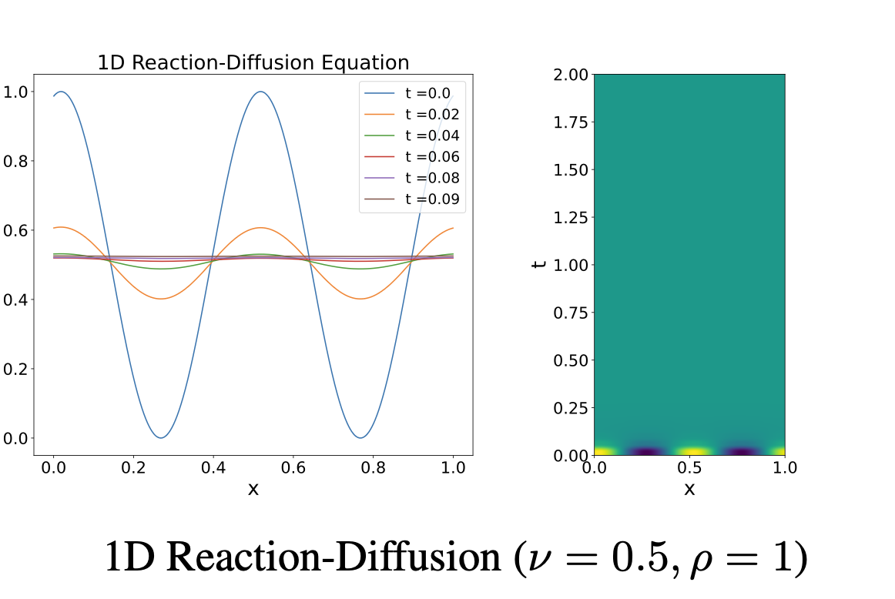

# 1D Diffusion–Reaction Equation

The 1D diffusion–reaction equation couples diffusion with a logistic-type source depending on $u$. The source can drive rapid growth or saturation and strong time-scale separation, while diffusion damps spatial high frequencies—useful for fast transients and multi-parameter conditioning.



## Parent dataset and access

| Field | Value |
|---|---|
| Parent dataset | **PDEBench** |
| Dataset paper | [PDEBench: An Extensive Benchmark for Scientific Machine Learning](https://arxiv.org/abs/2210.07182) |
| Paper PDF | [arXiv PDF](https://arxiv.org/pdf/2210.07182) |
| Official repository | [pdebench/PDEBench](https://github.com/pdebench/PDEBench) |
| Dataset DOI / DaRUS | [10.18419/darus-2986](https://doi.org/10.18419/darus-2986) |
| Current download category | `1d_reacdiff` |
| Data size | 62 GB |
| Data-generation entry point | [data_gen_NLE/ReactionDiffusionEq](https://github.com/pdebench/PDEBench/tree/main/pdebench/data_gen/data_gen_NLE/ReactionDiffusionEq) |
| Last checked | 2026-07-21 |

## Governing equation

\[
\partial_tu-\nu\partial_{xx}u-\rho u(1-u)=0,
\qquad x\in(0,1),\quad t\in(0,1],
\]
\[
u(0,x)=u_0(x).
\]

## Variables and coordinates

**State variables**
- $u(t,x)$: scalar state / concentration field.

**Parameters**
- $\nu$: diffusion coefficient.
- $\rho$: reaction / source coefficient (Fisher-type source $\rho u(1-u)$).

**Coordinates and domain**
- Space: uniform 1D Cartesian coordinate $x\in(0,1)$.
- Time: $t\in(0,1]$.

## About the data

| Attribute | Value |
|---|---|
| Spatial dim | 1 |
| Time-dependent | yes |
| Grid | uniform 1D Cartesian |
| Domain | $x\in(0,1)$ |
| Time range | $t\in[0,1]$ |
| Spatial res. | 1024 |
| Time steps | 201 |
| Trajectories / file | 10,000 |
| Channels | 1: $u$ |
| Sample shape | $201\times1024\times1$ |
| Size | 62 GB |
| Format | HDF5 |

## Initial conditions

A randomized sinusoidal superposition is generated first, then an absolute value and maximum-value normalization are applied so that the initial state is suitable for the $u(1-u)$ reaction term. The spectrum and seed vary by trajectory.

## Boundary conditions

Periodic boundary conditions.

## Numerical generation

The diffusion part uses second-order centered differences in space and time; the source term uses a piecewise-exact solution (PES) update.

## Parameters

| Parameter | How it varies | Values |
|---|---|---|
| $\nu$ (diffusion) | differs across HDF5 files | $\nu\in\{0.5,1,2,5\}$ |
| $\rho$ (reaction rate) | differs across HDF5 files | $\rho\in\{1,2,5,10\}$ → $4\times4=16$ training files |
| IC spectrum / amplitude / phase | per trajectory | Fourier sum, then abs + normalize |
| BC, grid, time, scheme | fixed | periodic; $N_x=1024$; $t\in[0,1]$ |

## Released configurations

Sixteen released training files form a $4\times4$ parameter grid, with 10,000 trajectories per file. The current download category also includes additional reaction test files.

## Data files

The current official download manifest (`pdebench_data_urls.csv`) lists **36** files; paths are relative to the download root. See [Data format](../00_data_format/).

- `1D/ReactionDiffusion/Train/ReacDiff_Nu0.5_Rho1.0.hdf5`
- `1D/ReactionDiffusion/Train/ReacDiff_Nu0.5_Rho2.0.hdf5`
- `1D/ReactionDiffusion/Train/ReacDiff_Nu0.5_Rho5.0.hdf5`
- `1D/ReactionDiffusion/Train/ReacDiff_Nu0.5_Rho10.0.hdf5`
- `1D/ReactionDiffusion/Train/ReacDiff_Nu1.0_Rho1.0.hdf5`
- `1D/ReactionDiffusion/Train/ReacDiff_Nu1.0_Rho2.0.hdf5`
- `1D/ReactionDiffusion/Train/ReacDiff_Nu1.0_Rho5.0.hdf5`
- `1D/ReactionDiffusion/Train/ReacDiff_Nu1.0_Rho10.0.hdf5`
- `1D/ReactionDiffusion/Train/ReacDiff_Nu2.0_Rho1.0.hdf5`
- `1D/ReactionDiffusion/Train/ReacDiff_Nu2.0_Rho2.0.hdf5`
- `1D/ReactionDiffusion/Train/ReacDiff_Nu2.0_Rho5.0.hdf5`
- `1D/ReactionDiffusion/Train/ReacDiff_Nu2.0_Rho10.0.hdf5`
- `1D/ReactionDiffusion/Train/ReacDiff_Nu5.0_Rho1.0.hdf5`
- `1D/ReactionDiffusion/Train/ReacDiff_Nu5.0_Rho2.0.hdf5`
- `1D/ReactionDiffusion/Train/ReacDiff_Nu5.0_Rho5.0.hdf5`
- `1D/ReactionDiffusion/Train/ReacDiff_Nu5.0_Rho10.0.hdf5`
- `1D/ReactionDiffusion/Test/ReacDiff_react_Nu0.5_Rho1.0.hdf5`
- `1D/ReactionDiffusion/Test/ReacDiff_react_Nu0.5_Rho2.0.hdf5`
- `1D/ReactionDiffusion/Test/ReacDiff_react_Nu0.5_Rho5.0.hdf5`
- `1D/ReactionDiffusion/Test/ReacDiff_react_Nu0.5_Rho10.0.hdf5`
- `1D/ReactionDiffusion/Test/ReacDiff_react_Nu1.0_Rho1.0.hdf5`
- `1D/ReactionDiffusion/Test/ReacDiff_react_Nu1.0_Rho2.0.hdf5`
- `1D/ReactionDiffusion/Test/ReacDiff_react_Nu1.0_Rho5.0.hdf5`
- `1D/ReactionDiffusion/Test/ReacDiff_react_Nu1.0_Rho10.0.hdf5`
- `1D/ReactionDiffusion/Test/ReacDiff_react_Nu2.0_Rho1.0.hdf5`
- `1D/ReactionDiffusion/Test/ReacDiff_react_Nu2.0_Rho2.0.hdf5`
- `1D/ReactionDiffusion/Test/ReacDiff_react_Nu2.0_Rho5.0.hdf5`
- `1D/ReactionDiffusion/Test/ReacDiff_react_Nu2.0_Rho10.0.hdf5`
- `1D/ReactionDiffusion/Test/ReacDiff_react_Nu5.0_Rho1.0.hdf5`
- `1D/ReactionDiffusion/Test/ReacDiff_react_Nu5.0_Rho2.0.hdf5`
- `1D/ReactionDiffusion/Test/ReacDiff_react_Nu5.0_Rho5.0.hdf5`
- `1D/ReactionDiffusion/Test/ReacDiff_react_Nu5.0_Rho10.0.hdf5`
- `1D/ReactionDiffusion/Test/ReacDiff_react_Nu10.0_Rho1.0.hdf5`
- `1D/ReactionDiffusion/Test/ReacDiff_react_Nu10.0_Rho2.0.hdf5`
- `1D/ReactionDiffusion/Test/ReacDiff_react_Nu10.0_Rho5.0.hdf5`
- `1D/ReactionDiffusion/Test/ReacDiff_react_Nu10.0_Rho10.0.hdf5`

## Data layout and machine-learning task

Scalar trajectory forecasting. For multi-configuration training, supply $\nu$ and $\rho$ as separate physical conditions rather than encoding them only through filenames.

- **Trajectory versus training example:** a complete HDF5 trajectory is not a fixed neural-network input. Autoregressive training normally extracts $\ell$ input frames and a one-step or multi-step target; $\ell$ is controlled by `initial_step` in the training configuration.
- **Source precedence:** equations, initial/boundary conditions and publication-scale statistics follow paper v7 and its supplement; current commands, paths and download categories follow the official GitHub `main` branch. Discrepancies are preserved rather than silently reconciled.

## Download

The current repository recommends `download_direct.py`; the EasyDataverse route is documented as slower and potentially error-prone.

```bash
git clone https://github.com/pdebench/PDEBench.git
cd PDEBench/pdebench/data_download
python download_direct.py --root_folder /path/to/pdebench_data --pde_name 1d_reacdiff
```

Files may also be selected manually from the [DaRUS DOI page](https://doi.org/10.18419/darus-2986). After downloading, inspect the actual HDF5 `shape`, coordinate arrays, variable keys and YAML attributes. In particular, do not infer CFD or incompressible-NS resolution solely from a filename.

## Regenerating from the official code

```bash
cd PDEBench/pdebench/data_gen/data_gen_NLE/ReactionDiffusionEq
CUDA_VISIBLE_DEVICES=0 python3 reaction_diffusion_multi_solution_Hydra.py +multi=Rho2e0_Nu5e0.yaml
bash run_trainset.sh
cd ..
python Data_Merge.py
```

Generator parameters can be changed through the corresponding Hydra YAML. NLE generators first write `.npy` arrays; run `Data_Merge.py` to obtain the HDF5 layout used by the official dataloaders.

## What is interesting and challenging about the data

Large reaction rates create very fast transients followed by nearly saturated states, so time-averaged errors can hide early dynamics. Parameter scales differ substantially.

## Primary sources

- [PDEBench paper and supplementary material](https://arxiv.org/abs/2210.07182)
- [Official PDEBench repository](https://github.com/pdebench/PDEBench)
- [Official download instructions](https://github.com/pdebench/PDEBench/tree/main/pdebench/data_download)
- [PDEBench dataset DOI](https://doi.org/10.18419/darus-2986)
