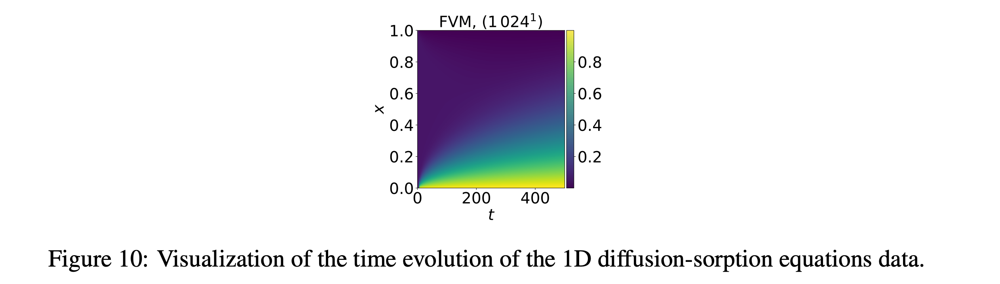

# 1D Diffusion–Sorption Equation

The diffusion–sorption equation models diffusion retarded by sorption, with groundwater contaminant transport as a typical application. Effective diffusivity is divided by a concentration-dependent Freundlich retardation factor that becomes singular as $u\to 0$, and the boundaries include a nonstandard derivative relation rather than only periodic or homogeneous conditions.



## Parent dataset and access

| Field | Value |
|---|---|
| Parent dataset | **PDEBench** |
| Dataset paper | [PDEBench: An Extensive Benchmark for Scientific Machine Learning](https://arxiv.org/abs/2210.07182) |
| Paper PDF | [arXiv PDF](https://arxiv.org/pdf/2210.07182) |
| Official repository | [pdebench/PDEBench](https://github.com/pdebench/PDEBench) |
| Dataset DOI / DaRUS | [10.18419/darus-2986](https://doi.org/10.18419/darus-2986) |
| Current download category | `diff_sorp` |
| Data size | 4 GB |
| Data-generation entry point | [gen_diff_sorp.py + configs/diff-sorp.yaml](https://github.com/pdebench/PDEBench/blob/main/pdebench/data_gen/gen_diff_sorp.py) |
| Last checked | 2026-07-21 |

## Governing equation

\[
\partial_tu(t,x)=\frac{D}{R(u)}\,\partial_{xx}u(t,x),\qquad x\in(0,1),\quad t\in(0,500],
\]
\[
R(u)=1+\frac{1-\phi}{\phi}\rho_s k n_f u^{n_f-1}.
\]

## Variables and coordinates

**State variables**
- $u(t,x)$: solute concentration.

**Parameters and medium quantities**
- $D$: effective diffusion coefficient (release value $D=5\times10^{-4}$).
- $R(u)$: sorption retardation factor, concentration-dependent.
- $\phi$: porosity ($0.29$).
- $\rho_s$: bulk density ($2880$).
- $k$: Freundlich coefficient ($3.5\times10^{-4}$).
- $n_f$: Freundlich exponent ($0.874$).

**Coordinates and domain**
- Space: uniform 1D finite-volume grid, $x\in(0,1)$.
- Time: $t\in(0,500]$.

## About the data

| Attribute | Value |
|---|---|
| Spatial dim | 1 |
| Time-dependent | yes |
| Grid | uniform 1D finite volume |
| Domain | $x\in(0,1)$ |
| Time range | $t\in[0,500]$ |
| Spatial res. | 1024 |
| Time steps | raw 501; training often 101 |
| Trajectories / file | 10,000 |
| Channels | 1: $u$ (concentration) |
| Sample shape | train $101\times1024\times1$; raw $501\times1024\times1$ |
| Size | 4 GB |
| Format | HDF5 |

## Initial conditions

The paper writes $u(0,x)\sim\mathcal U(0,0.2)$; released examples show a spatially constant initial value sampled independently for each trajectory.

## Boundary conditions

The paper states
\[
u(t,0)=1.0,\qquad u(t,1)=D\,\partial_xu(t,1).
\]
The main text classifies this as a Cauchy-type boundary. The derivative condition is less naturally represented by standard convolutional padding.

## Numerical generation

Space is discretized by a finite-volume method. The paper text says a built-in fourth-order Runge–Kutta method, whereas the current YAML metadata labels the integrator RK45 (adaptive order 5(4)); record the exact code version used. The current configuration sets `D=5e-4, por=0.29, rho_s=2880, k_f=3.5e-4, n_f=0.874, t=500, tdim=501, xdim=1024`.

## Parameters

| Parameter | How it varies | Values |
|---|---|---|
| $D,\phi,\rho_s,k,n_f$ | fixed | $D=5\times10^{-4}$, $\phi=0.29$, $\rho_s=2880$, $k=3.5\times10^{-4}$, $n_f=0.874$; filename `NA_NA` |
| initial concentration | per trajectory | $u(0,x)\sim\mathcal U(0,0.2)$ (examples: spatially constant draws) |
| BC, domain, grid, time | fixed | Cauchy; $x\in(0,1)$; $N_x=1024$ |

## Released configurations

One main released file, `1D_diff-sorp_NA_NA.h5`, containing 10,000 trajectories. `NA_NA` reflects the absence of a released parameter scan.

## Data files

The current official download manifest (`pdebench_data_urls.csv`) lists **1** files; paths are relative to the download root. See [Data format](../00_data_format/).

- `1D/diffusion-sorption/1D_diff-sorp_NA_NA.h5`

## Data layout and machine-learning task

Single-channel concentration forecasting. Inverse inference of initial conditions or material parameters is possible conceptually, but the released file does not provide material-parameter diversity.

- **Trajectory versus training example:** a complete HDF5 trajectory is not a fixed neural-network input. Autoregressive training normally extracts $\ell$ input frames and a one-step or multi-step target; $\ell$ is controlled by `initial_step` in the training configuration.
- **Source precedence:** equations, initial/boundary conditions and publication-scale statistics follow paper v7 and its supplement; current commands, paths and download categories follow the official GitHub `main` branch. Discrepancies are preserved rather than silently reconciled.

## Download

The current repository recommends `download_direct.py`; the EasyDataverse route is documented as slower and potentially error-prone.

```bash
git clone https://github.com/pdebench/PDEBench.git
cd PDEBench/pdebench/data_download
python download_direct.py --root_folder /path/to/pdebench_data --pde_name diff_sorp
```

Files may also be selected manually from the [DaRUS DOI page](https://doi.org/10.18419/darus-2986). After downloading, inspect the actual HDF5 `shape`, coordinate arrays, variable keys and YAML attributes. In particular, do not infer CFD or incompressible-NS resolution solely from a filename.

## Regenerating from the official code

```bash
cd PDEBench
python -m pdebench.data_gen.gen_diff_sorp
# Hydra configuration: pdebench/data_gen/configs/diff-sorp.yaml
```

Generator parameters can be changed through the corresponding Hydra YAML. This generation path writes HDF5 directly and does not require `Data_Merge.py`.

## What is interesting and challenging about the data

Singular retardation as $u\to0$, a very long time horizon, a nonstandard derivative boundary and localized errors near the concentration front.

## Primary sources

- [PDEBench paper and supplementary material](https://arxiv.org/abs/2210.07182)
- [Official PDEBench repository](https://github.com/pdebench/PDEBench)
- [Official download instructions](https://github.com/pdebench/PDEBench/tree/main/pdebench/data_download)
- [PDEBench dataset DOI](https://doi.org/10.18419/darus-2986)
