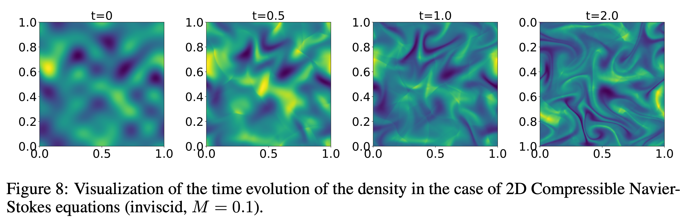

# 2D Compressible Navier–Stokes / CFD

2D compressible Navier–Stokes retains compressible waves and shocks while adding vortical structure and turbulent spectra. Training configurations scan Mach number, viscosity and random-field / turbulence initial-condition families on a periodic domain.



## Parent dataset and access

| Field | Value |
|---|---|
| Parent dataset | **PDEBench** |
| Dataset paper | [PDEBench: An Extensive Benchmark for Scientific Machine Learning](https://arxiv.org/abs/2210.07182) |
| Paper PDF | [arXiv PDF](https://arxiv.org/pdf/2210.07182) |
| Official repository | [pdebench/PDEBench](https://github.com/pdebench/PDEBench) |
| Dataset DOI / DaRUS | [10.18419/darus-2986](https://doi.org/10.18419/darus-2986) |
| Current download category | `2d_cfd` |
| Data size | 551 GB |
| Data-generation entry point | [data_gen_NLE/CompressibleFluid](https://github.com/pdebench/PDEBench/tree/main/pdebench/data_gen/data_gen_NLE/CompressibleFluid) |
| Last checked | 2026-07-21 |

## Governing equation

\[
\partial_t\rho+\nabla\cdot(\rho\mathbf v)=0,
\]
\[
\rho(\partial_t\mathbf v+\mathbf v\cdot\nabla\mathbf v)
=-\nabla p+\eta\Delta\mathbf v+\left(\zeta+\frac{\eta}{3}\right)\nabla(\nabla\cdot\mathbf v),
\]
\[
\partial_t\!\left(\epsilon+\frac{\rho|\mathbf v|^2}{2}\right)
+\nabla\cdot\!\left[\left(\epsilon+p+\frac{\rho|\mathbf v|^2}{2}\right)\mathbf v-\mathbf v\cdot\boldsymbol\sigma'\right]=0,
\qquad \epsilon=\frac{p}{\Gamma-1},\quad \Gamma=\frac53.
\]

## Variables and coordinates

**State variables**
- $\rho$: mass density.
- $p$: gas pressure.
- $\mathbf{v}=(v_x,v_y)$: 2D velocity.
- $\epsilon=p/(\Gamma-1)$: internal energy (equation-of-state derived).

**Parameters and auxiliaries**
- $N_d=2$: number of spatial dimensions.
- $\Gamma=5/3$: heat-capacity ratio.
- $\eta,\zeta$: shear and bulk viscosities.
- $\boldsymbol{\sigma}'$: viscous stress tensor.
- Mach number $M=|\mathbf{v}|/c_s$ with sound speed $c_s=\sqrt{\Gamma p/\rho}$.

**Coordinates and domain**
- Space: uniform 2D Cartesian periodic grid; read coordinate ranges from HDF5 / YAML.
- Time: typically 21 stored frames; physical time from coordinates / attributes.
- Logical channel order: $[\rho,p,v_x,v_y]$.

## About the data

| Attribute | Value |
|---|---|
| Spatial dim | 2 |
| Time-dependent | yes |
| Grid | uniform 2D periodic Cartesian |
| Domain | from HDF5 coords |
| Time range | from coords/attributes |
| Spatial res. | most training files $512\times512$; some $128\times128$ (check HDF5 shape) |
| Time steps | 21 |
| Trajectories / file | 1,000 |
| Channels | 4: $\rho$, $p$, $v_x$, $v_y$ |
| Sample shape | $21\times512\times512\times4$ |
| Size | 551 GB |
| Format | HDF5 |

## Initial conditions

PDEBench uses three initial-condition families for compressible NS.

### 1. Random field

The 1D randomized sinusoidal superposition (paper Eq. 8) is extended to 2D as multidimensional sinusoidal random fields. Density and pressure are prepared by adding a uniform background to a perturbation field.

### 2. Turbulence

Mass density and pressure are taken as uniform. The initial velocity is (paper Eq. 17)
\[
\mathbf{v}(\mathbf{x},t=0)=\sum_{i=1}^{n}\mathbf{A}_i\sin(k_i x+\phi_i),
\]
with $n=4$ and amplitude $A_i=\bar{v}/|k_i|^d$, where $d=1$ in 2D. The mean velocity $\bar{v}$ is set by the initial Mach number via $\bar{v}=c_s M$, where $c_s=\sqrt{\Gamma p/\rho}$. A Helmholtz decomposition in Fourier space then subtracts the compressible component from this velocity field.

### 3. Shock tube / Riemann

The shock-tube initial field is
\[
Q(\mathbf{x},t=0)=(Q_L,Q_R),\qquad Q=(\rho,\mathbf{v},p),
\]
where the left/right constant states $Q_L,Q_R$ and the discontinuity location are randomized. This Riemann problem generates shocks and rarefactions and is a rigorous test for ML models; the 2D main training list emphasizes random / turbulence, while shock cases are often extra test files.

## Boundary conditions

- **Periodic:** all eight main training configurations use periodic boundaries.
- **Outgoing:** neighboring interior cells are copied into boundary ghost regions so waves and fluid can leave the domain (also common in astrohydrodynamics). Additional current test files may use outgoing or other classical-flow setups.

## Numerical generation

The inviscid part of the conservation laws is advanced with a temporally and spatially second-order **HLLC** Riemann scheme with **MUSCL** reconstruction; viscous terms use centered differences. Logical state channels are $\rho$, $p$, and velocity components; internal energy follows from $\epsilon=p/(\Gamma-1)$.

## Parameters

Equation:

\[
\partial_t\rho+\nabla\cdot(\rho\mathbf v)=0,
\]
\[
\rho(\partial_t\mathbf v+\mathbf v\cdot\nabla\mathbf v)
=-\nabla p+\eta\Delta\mathbf v+\left(\zeta+\frac{\eta}{3}\right)\nabla(\nabla\cdot\mathbf v),
\]
\[
\partial_t\!\left(\epsilon+\frac{\rho|\mathbf v|^2}{2}\right)
+\nabla\cdot\!\left[\left(\epsilon+p+\frac{\rho|\mathbf v|^2}{2}\right)\mathbf v-\mathbf v\cdot\boldsymbol\sigma'\right]=0,
\qquad \epsilon=\frac{p}{\Gamma-1},\quad \Gamma=\frac53.
\]

### Released file configs

**Paper vs release:** summaries often list all 2D cases as $512\times512$; filenames use `_512_` for near-inviscid and `_128_` for higher viscosity.  
KH / shock / OTVortex are an **extra test set** (classic / specialized flows outside the main random/turbulence sweep). Parameters are in the **filename or YAML**, not missing.

| Data file | initial field | boundary | $(\eta,\zeta,M)$ or other | $N_s$ | Per trajectory | Note |
|---|---|---|---|---:|---|---|
| `2D_CFD_Rand_M0.1_Eta1e-08_Zeta1e-08_periodic_512_Train.hdf5` | random field | periodic | $(10^{-8},10^{-8},0.1)$ | $512$ | random field | main train |
| `2D_CFD_Rand_M0.1_Eta0.01_Zeta0.01_periodic_128_Train.hdf5` | random field | periodic | $(10^{-2},10^{-2},0.1)$ | $128$ | same | main train |
| `2D_CFD_Rand_M0.1_Eta0.1_Zeta0.1_periodic_128_Train.hdf5` | random field | periodic | $(10^{-1},10^{-1},0.1)$ | $128$ | same | main train |
| `2D_CFD_Rand_M1.0_Eta1e-08_Zeta1e-08_periodic_512_Train.hdf5` | random field | periodic | $(10^{-8},10^{-8},1.0)$ | $512$ | same | main train |
| `2D_CFD_Rand_M1.0_Eta0.01_Zeta0.01_periodic_128_Train.hdf5` | random field | periodic | $(10^{-2},10^{-2},1.0)$ | $128$ | same | main train |
| `2D_CFD_Rand_M1.0_Eta0.1_Zeta0.1_periodic_128_Train.hdf5` | random field | periodic | $(10^{-1},10^{-1},1.0)$ | $128$ | same | main train |
| `2D_CFD_Turb_M0.1_Eta1e-08_Zeta1e-08_periodic_512_Train.hdf5` | turbulence | periodic | $(10^{-8},10^{-8},0.1)$ | $512$ | turb. seed | main train |
| `2D_CFD_Turb_M1.0_Eta1e-08_Zeta1e-08_periodic_512_Train.hdf5` | turbulence | periodic | $(10^{-8},10^{-8},1.0)$ | $512$ | same | main train |
| `2D_shock.hdf5` | 2D shock tube | outgoing (`trans`) | $(10^{-8},10^{-8},1.0)$ | $1024$ | no | extra test (YAML) |
| `KH_M01_dk1_Re1e3.hdf5` | Kelvin–Helmholtz | `KHI` | $\eta=10^{-3},\zeta=10^{-8},M=0.1,\mathrm{dk}=1$ | $1024$ | no | extra test (YAML; $\mathrm{Re}=10^3$ in path) |
| `KH_M1_dk1_Re1e3.hdf5` | Kelvin–Helmholtz | `KHI` | same family, $M=1$, $\mathrm{dk}=1$ | $1024$ | no | extra test |
| `KH_M01_dk2_Re1e3.hdf5` | Kelvin–Helmholtz | `KHI` | same family, $M=0.1$, $\mathrm{dk}=2$ | $1024$ | no | extra test |
| `KH_M01_dk5_Re1e3.hdf5` | Kelvin–Helmholtz | `KHI` | same family, $M=0.1$, $\mathrm{dk}=5$ | $1024$ | no | extra test |
| `KH_M01_dk10_Re1e3.hdf5` | Kelvin–Helmholtz | `KHI` | same family, $M=0.1$, $\mathrm{dk}=10$ | $1024$ | no | extra test |
| `KH_M02_dk1_Re1e3.hdf5` | Kelvin–Helmholtz | `KHI` | same family, $M=0.2$, $\mathrm{dk}=1$ | $1024$ | no | extra test |
| `KH_M04_dk1_Re1e3.hdf5` | Kelvin–Helmholtz | `KHI` | same family, $M=0.4$, $\mathrm{dk}=1$ | $1024$ | no | extra test |
| `OTVortex.hdf5` | Orszag–Tang | periodic | $(10^{-8},10^{-8},1.0)$ | $1024$ | no | extra test (YAML) |

### Generator-tunable ranges

| Parameter | Tunable range / options | Covered by release? |
|---|---|---|
| $\eta,\zeta$ | any nonnegative; common three levels above | main train yes; $N_s$ follows viscosity |
| $M$ | any positive; main train $\{0.1,1.0\}$ | main train yes; KH tests add $0.2,0.4$, … |
| IC family | random / turbulence / shock / KH / OT … | main + extra tests |
| KH $\mathrm{dk},\mathrm{Re}$ | editable; repo has more KH YAMLs than the download list | partial (7 KH files above) |
| grid $N_s$, time window | editable | release $128$ or $512$, $N_t=21$ |

## Data files

The current official download manifest (`pdebench_data_urls.csv`) lists **17** files; paths are relative to the download root. See [Data format](../00_data_format/).

- `2D/CFD/2D_Train_Rand/2D_CFD_Rand_M0.1_Eta0.01_Zeta0.01_periodic_128_Train.hdf5`
- `2D/CFD/2D_Train_Rand/2D_CFD_Rand_M0.1_Eta0.1_Zeta0.1_periodic_128_Train.hdf5`
- `2D/CFD/2D_Train_Rand/2D_CFD_Rand_M0.1_Eta1e-08_Zeta1e-08_periodic_512_Train.hdf5`
- `2D/CFD/2D_Train_Rand/2D_CFD_Rand_M1.0_Eta0.01_Zeta0.01_periodic_128_Train.hdf5`
- `2D/CFD/2D_Train_Rand/2D_CFD_Rand_M1.0_Eta0.1_Zeta0.1_periodic_128_Train.hdf5`
- `2D/CFD/2D_Train_Rand/2D_CFD_Rand_M1.0_Eta1e-08_Zeta1e-08_periodic_512_Train.hdf5`
- `2D/CFD/2D_Train_Turb/2D_CFD_Turb_M0.1_Eta1e-08_Zeta1e-08_periodic_512_Train.hdf5`
- `2D/CFD/2D_Train_Turb/2D_CFD_Turb_M1.0_Eta1e-08_Zeta1e-08_periodic_512_Train.hdf5`
- `2D/CFD/Test/2DShock/2D_shock.hdf5`
- `2D/CFD/Test/KH/KH_M01_dk1_Re1e3.hdf5`
- `2D/CFD/Test/KH/KH_M1_dk1_Re1e3.hdf5`
- `2D/CFD/Test/KH/KH_M01_dk2_Re1e3.hdf5`
- `2D/CFD/Test/KH/KH_M01_dk5_Re1e3.hdf5`
- `2D/CFD/Test/KH/KH_M01_dk10_Re1e3.hdf5`
- `2D/CFD/Test/KH/KH_M02_dk1_Re1e3.hdf5`
- `2D/CFD/Test/KH/KH_M04_dk1_Re1e3.hdf5`
- `2D/CFD/Test/TOV/OTVortex.hdf5`

## Data layout and machine-learning task

Four-channel temporal forecasting; explicitly condition on $M,\eta,\zeta$ and the `random/turbulence` IC label.

- **Trajectory versus training example:** a complete HDF5 trajectory is not a fixed neural-network input. Autoregressive training normally extracts $\ell$ input frames and a one-step or multi-step target; $\ell$ is controlled by `initial_step` in the training configuration.
- **Source precedence:** equations, initial/boundary conditions and publication-scale statistics follow paper v7 and its supplement; current commands, paths and download categories follow the official GitHub `main` branch. Discrepancies are preserved rather than silently reconciled.

## Download

The current repository recommends `download_direct.py`; the EasyDataverse route is documented as slower and potentially error-prone.

```bash
git clone https://github.com/pdebench/PDEBench.git
cd PDEBench/pdebench/data_download
python download_direct.py --root_folder /path/to/pdebench_data --pde_name 2d_cfd
```

Files may also be selected manually from the [DaRUS DOI page](https://doi.org/10.18419/darus-2986). After downloading, inspect the actual HDF5 `shape`, coordinate arrays, variable keys and YAML attributes. In particular, do not infer CFD or incompressible-NS resolution solely from a filename.

## Regenerating from the official code

```bash
cd PDEBench/pdebench/data_gen/data_gen_NLE/CompressibleFluid
bash run_trainset_2D.sh
bash run_trainset_2DTurb.sh
# optional test sets
bash run_testset.sh
bash run_testset_KHI.sh
cd ..
python Data_Merge.py
```

Generator parameters can be changed through the corresponding Hydra YAML. NLE generators first write `.npy` arrays; run `Data_Merge.py` to obtain the HDF5 layout used by the official dataloaders.

## What is interesting and challenging about the data

Very large high-resolution trajectories, coexistence of shocks and vortices, variation in Mach number/viscosity, and current files whose resolutions do not all match the paper-wide $512^2$ summary.

## Primary sources

- [PDEBench paper and supplementary material](https://arxiv.org/abs/2210.07182)
- [Official PDEBench repository](https://github.com/pdebench/PDEBench)
- [Official download instructions](https://github.com/pdebench/PDEBench/tree/main/pdebench/data_download)
- [PDEBench dataset DOI](https://doi.org/10.18419/darus-2986)
