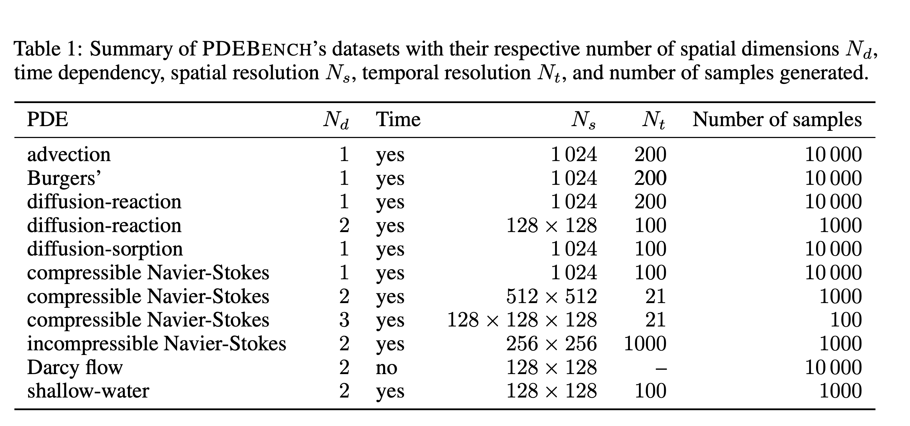

# PDEBench

## Problem Definition

A solution to a PDE is a vector-valued function $\mathbf{v} : \mathcal{T} \times \mathcal{S} \times \Theta \rightarrow \mathbb{R}^{d}$ on some spatial domain $\mathcal{S}$, with temporal index $\mathcal{T}$, and some possibly function-valued parameter-space $\Theta$. For example in a heat diffusion equation, $\mathbf{v}$ might represent the local temperature $\tau \in \mathbb{R}^{1}$ of some substrate at some given point $\mathbf{s} \in \mathcal{S}$, at a given moment $t \in \mathcal{T}$, and conditional upon a spatially-varying scalar conductivity field representing an inhomogeneous substrate $\theta : \mathcal{S} \rightarrow \mathbb{R}^{+}$. The operator mapping from the state of the solution at one timestep to the solution one time step later, $\mathfrak{F}_{\theta} : \mathbf{v}_{\theta}(t,\cdot) \rightarrow \mathbf{v}_{\theta}(t+1,\cdot)$ is referred to as the *forward propagator*.

The objective of Scientific ML is to find some ML-based surrogate, sometimes referred to as an emulator, of this forward propagator by learning an approximation $\widehat{\mathfrak{F}}_{\theta} \simeq \mathfrak{F}_{\theta}$. The forward propagator of a PDE is dependent not only on the current state, but also upon both spatial and temporal derivatives of the state field. In practice, temporal derivatives of solutions are often not conveniently encoded by system states at one single time step. Hence, the forward propagator may also depend on multiple previous timesteps of the solution, enabling finite-difference approximations of the temporal derivatives. The discretised forward propagator $\mathring{\mathfrak{F}}_{\theta}$ then operates on $\ell \geq 1$ consecutive timesteps so that $\mathring{\mathfrak{F}}_{\theta} : \mathbf{v}_{\theta}(t-\ell,\cdot),\dots,\mathbf{v}_{\theta}(t-1,\cdot) \mapsto \mathbf{v}_{\theta}(t,\cdot)$, which is abbreviated as $\mathbf{v}_{\theta}([t-\ell:t-1],\cdot) := \mathbf{v}_{\theta}(t-\ell,\cdot),\dots,\mathbf{v}_{\theta}(t-1,\cdot)$.

We seek to approximate this discretised operator with an emulator $\widehat{\mathfrak{F}}_{\theta} \simeq \mathring{\mathfrak{F}}_{\theta}$ in the sense that predictions the emulator makes should be close to the ground truth simulation given the same inputs, with respect to some measure of cost. We fix a parametric class of models $\{\mathfrak{F}_{\theta,\phi}\}_{\phi}$. From this class we learn a surrogate $\widehat{\mathfrak{F}}_{\theta,\phi}$ from data. In learning, we take a dataset $\mathcal{D}$ comprising discretized PDE solutions conditional on selected parameter values $(\theta_k)$, $\mathcal{D} := \{\mathbf{v}_{\theta_k}^{(k)}([0:t_{\mathrm{max}}],\cdot) \mid k=1,\dots,K\}$. Fixing a loss functional $L$, we aim to find some $\phi$ achieving a minimal total loss on the training dataset

\[
\hat{\phi} = \operatorname{argmin}_{\phi} \sum_{t=1}^{t_{\mathrm{max}}} \sum_{k=1}^{K} L\Bigl(\mathfrak{F}_{\theta_k,\phi}\{\mathbf{v}_{\theta_k}^{(k)}([t-\ell:t-1],\cdot)\},\mathbf{v}_{\theta_k}^{(k)}(t,\cdot)\Bigr).
\]

Due to the use of iterative optimization algorithms such as stochastic gradient descent and the non-convex nature of the above optimization problem, we typically obtain local optima. $\mathcal{D}$ is generated by a ground-truth solver designed to simulate the desired dynamics with high precision. In this data we may vary initial conditions, that is, varying $\mathbf{v}_{\theta}(0,\cdot)$, varying $\theta$, or both.

In addition to the forward problem, we also consider the use of learned surrogate models to approximately solve *inverse problems*, where an unknown initial condition $\mathbf{v}_{\theta}(0,\cdot)$ or unknown parameter $\theta$ is chosen to be congruent with some observed outputs $\mathbf{v}_{\theta}([t:t+\ell],\cdot)$. We follow an approximate surrogate approach, taking the forward surrogates as mean predictors for the model. We assume $\mathbf{v}_{\theta}(t,\cdot) = \mathfrak{F}_{\theta,\phi}\{\mathbf{v}_{\theta}([t-\ell:t-1],\cdot)\} + \epsilon$ for some mean-zero observation noise $\epsilon$, and assuming a prior distribution for the unknown of interest. Other inversion methods can be used in this domain, such as generative adversarial models or variational autoencoders.

## Equation catalog

Start with [Data format](./00_data_format/) (HDF5 conventions); each equation card also lists its download files.

| # | Equation card | Download key | Current advertised size |
|---:|---|---|---:|
| — | [Data format](./00_data_format/) | — | — |
| 1 | [1D Linear Advection Equation](./01_advection_1d/) | `advection` | 47 GB |
| 2 | [1D Burgers' Equation](./02_burgers_1d/) | `burgers` | 93 GB |
| 3 | [1D Diffusion–Reaction Equation](./03_reaction_diffusion_1d/) | `1d_reacdiff` | 62 GB |
| 4 | [1D Diffusion–Sorption Equation](./04_diffusion_sorption_1d/) | `diff_sorp` | 4 GB |
| 5 | [2D FitzHugh–Nagumo Diffusion–Reaction System](./05_reaction_diffusion_2d/) | `2d_reacdiff` | 13 GB |
| 6 | [2D Darcy Flow](./06_darcy_flow_2d/) | `darcy` | 6.2 GB |
| 7 | [2D Shallow-Water Equations: Radial Dam Break](./07_shallow_water_2d/) | `swe` | 6.2 GB |
| 8 | [1D Compressible Navier–Stokes / CFD](./08_compressible_ns_1d/) | `1d_cfd` | 88 GB |
| 9 | [2D Compressible Navier–Stokes / CFD](./09_compressible_ns_2d/) | `2d_cfd` | 551 GB |
| 10 | [3D Compressible Navier–Stokes / CFD](./10_compressible_ns_3d/) | `3d_cfd` | 285 GB |
| 11 | [2D Inhomogeneously Forced Incompressible Navier–Stokes](./11_incompressible_ns_2d/) | `ns_incom` | 2.3 TB |

## Shared conventions

- The paper describes 11 PDE/tasks and 35 baseline parameterizations; this is not the number of HDF5 files in the current manifest.
- The general HDF5 array convention is $(b,t,x_1,\ldots,x_d,v)$; compressible-NS variables may be stored as separate datasets. Details: [Data format](./00_data_format/).
- Darcy Flow is a static $a\mapsto u$ operator task; the other main tasks are temporal.
- The current advertised sizes of the eleven one-click categories sum to approximately **3.46 TB** using decimal GB/TB arithmetic.
