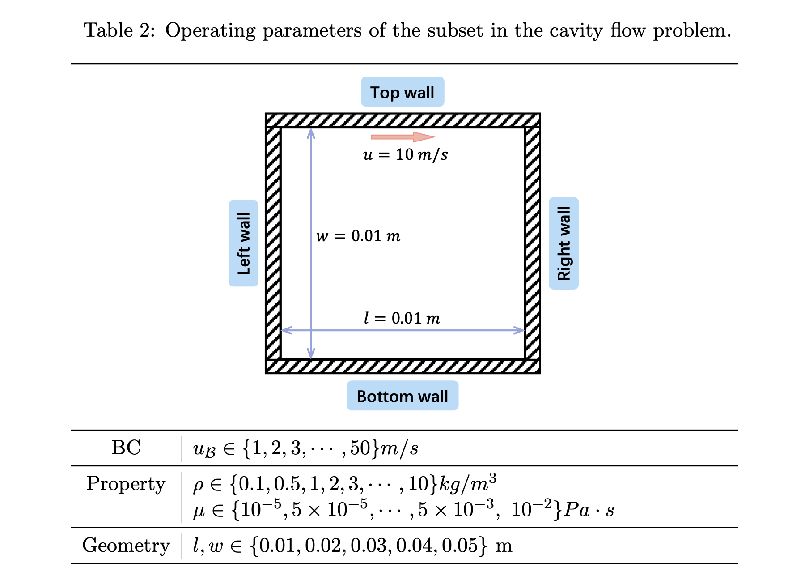

# CFDBench — 顶盖驱动方腔流（Cavity Flow）



**描述：** 二维矩形封闭腔体的顶部壁面以给定速度运动，黏性作用驱动腔内形成主涡和角部次级涡；数据分别扫描顶盖速度、流体密度/黏度和腔体长宽。 顶盖驱动方腔流是验证 CFD 数值方法的经典问题。它同时包含移动无滑移壁面、静止无滑移壁面以及顶盖与侧壁连接处的边界不连续。CFDBench 以该问题评估模型对未见边界速度、物性和矩形几何的推断时泛化。该数据不是五维参数的全组合，而是分别生成 BC、PROP、GEO 三个子集。

- 所属数据集： **CFDBench**
- 数据集作者：Yining Luo、Yingfa Chen、Zhen Zhang（清华大学）
- 生成软件：ANSYS Fluent 2021R1；网格/批处理脚本见 `generation-code/`
- 官方 loader：[`src/dataset/cavity.py`](https://github.com/luo-yining/CFDBench/blob/main/src/dataset/cavity.py)

## 控制方程

论文为四类问题统一写出二维不可压缩牛顿流体 Navier--Stokes 方程。守恒形式为

$$
\nabla\cdot(\rho\mathbf u)=0,
$$

$$
\frac{\partial(\rho\mathbf u)}{\partial t}
+\nabla\cdot(\rho\mathbf u\otimes\mathbf u)
=-\nabla p
+\nabla\cdot\left\{\mu\left[\nabla\mathbf u+(\nabla\mathbf u)^{\mathsf T}\right]\right\}
+\rho\mathbf g,
$$

其中 $\mathbf u=(u,v)^{\mathsf T}$，$u$、$v$ 分别是 $x$、$y$ 方向速度，$p$ 是压力，$\rho$ 是密度，$\mu$ 是动力黏度。除 dam 问题外，可取 $\mathbf g=\mathbf 0$。在 $\rho$、$\mu$ 为常数时，二维分量形式为

$$
\frac{\partial u}{\partial x}+\frac{\partial v}{\partial y}=0,
$$

$$
\frac{\partial u}{\partial t}
+u\frac{\partial u}{\partial x}
+v\frac{\partial u}{\partial y}
=-\frac{1}{\rho}\frac{\partial p}{\partial x}
+\frac{\mu}{\rho}\left(
\frac{\partial^2u}{\partial x^2}+\frac{\partial^2u}{\partial y^2}
\right)+g_x,
$$

$$
\frac{\partial v}{\partial t}
+u\frac{\partial v}{\partial x}
+v\frac{\partial v}{\partial y}
=-\frac{1}{\rho}\frac{\partial p}{\partial y}
+\frac{\mu}{\rho}\left(
\frac{\partial^2v}{\partial x^2}+\frac{\partial^2v}{\partial y^2}
\right)+g_y.
$$

> **方程范围说明。** 论文正文逐式写出的数学系统是上述不可压缩 Navier--Stokes 方程。Tube 和 Dam 的 Fluent 配置还使用 VOF 两相模型；Cylinder 的部分工况使用 SST $k$--$\omega$ 湍流闭合。论文没有完整列出 VOF 或 SST 的附加输运方程及模型常数。

## 物理区域、坐标与边界条件

物理域为

$$
D=[0,l]\times[0,w],
$$

$x$ 向右，$y$ 向上。顶部壁面沿 $+x$ 方向以 $u_\mathrm{{top}}$ 运动，其余三面静止：

$$
\mathbf u(x,w,t)=(u_\mathrm{{top}},0),\qquad
\mathbf u(x,0,t)=\mathbf 0,
$$

$$
\mathbf u(0,y,t)=\mathbf 0,\qquad
\mathbf u(l,y,t)=\mathbf 0.
$$

生成 Scheme 将压力和速度初始化为静止场，然后施加移动顶盖。顶盖和侧壁交点处的速度条件不连续，是该问题的重要数值难点。

## 关于数据

| 项目 | 数值或说明 |
|---|---|
| 空间维数 | 2D |
| 时间依赖 | 瞬态；可用于单步和多步预测 |
| 原始插值尺寸 | `u.npy`, `v.npy`: $(T_i,64,64)$ |
| 当前 loader 特征 | $(T_i,3,64,64)$，通道为 $(u,v,\mathrm{{mask}})$；mask 为全 1 |
| 物理输出 | $u$、$v$；压力不在插值压缩包的统一标签中 |
| 网格 | 插值后均匀笛卡尔网格；几何变化时物理网格间距随 $l,w$ 改变 |
| 轨迹/case | 159 = 50 BC + 84 PROP + 25 GEO |
| 总帧数 | 34,582 |
| 平均帧数 | 217.50，仅为平均值，不是固定 $T$ |
| 存储时间间隔 | 论文和 loader 均为 $\Delta t=0.1\,\mathrm s$ |
| 统一 $t_{\mathrm{max}}$ | 论文未给出；应由每个 `u.npy.shape[0]` 和 $\Delta t$ 计算 |
| 论文每帧原始量 | 约 5.2 MB |
| 论文生成时间 | 约 0.92 s/帧 |
| 当前压缩包 | `cavity.zip`，约 786 MB（2026-07-21） |

## 基准工况

$$
\rho=1\,\mathrm{{kg\,m^{{-3}}}},\qquad
\mu=10^{{-5}}\,\mathrm{{Pa\,s}},
$$

$$
l=w=0.01\,\mathrm m,\qquad
u_\mathrm{{top}}=10\,\mathrm{{m\,s^{{-1}}}}.
$$

代码中的工况参数顺序为

```text
[vel_top, density, viscosity, height, width]
```

## 参数

数据按互斥子集分别生成：每个子集只改变一类工况，其余固定为上一节的基准工况。取值来自论文表 2。

| 子集 | cases | 扫描参数与取值 | 固定（基准） |
|---|---:|---|---|
| BC | 50 | $u_{\mathrm{top}}=u_{\mathcal{B}}\in\{1,2,3,\ldots,50\}\,\mathrm{m/s}$（步长 $1$） | $\rho=1\,\mathrm{kg\,m^{-3}}$，$\mu=10^{-5}\,\mathrm{Pa\cdot s}$，$l=w=0.01\,\mathrm{m}$ |
| PROP | 84 | $\rho\in\{0.1,0.5,1,2,3,\ldots,10\}\,\mathrm{kg\,m^{-3}}$（12 个）；$\mu\in\{10^{-5},5\times10^{-5},\ldots,5\times10^{-3},10^{-2}\}\,\mathrm{Pa\cdot s}$（7 个）；$12\times7=84$ | $u_{\mathrm{top}}=10\,\mathrm{m/s}$，$l=w=0.01\,\mathrm{m}$ |
| GEO | 25 | $l,w\in\{0.01,0.02,0.03,0.04,0.05\}\,\mathrm{m}$（组合共 25） | $u_{\mathrm{top}}=10\,\mathrm{m/s}$，$\rho=1\,\mathrm{kg\,m^{-3}}$，$\mu=10^{-5}\,\mathrm{Pa\cdot s}$ |

## 数值生成设置

- 生成软件：ANSYS Fluent 2021R1；网格生成与批处理脚本位于仓库 `generation-code/`，其中包括 ICEM RPL 和 Fluent Scheme 文件。
- 层流/湍流：层流工况采用 laminar model；需要湍流闭合时采用 SST $k$--$\omega$。
- 压力--速度耦合：单相流采用 Coupled Scheme；两相流采用 SIMPLE。
- 空间离散：压力方程二阶插值；VOF 使用 PRESTO!；动量方程二阶迎风。
- 时间离散：一阶隐式。
- 插值：最小二乘；最终发布数据映射到 $64\times64$ 笛卡尔网格。
- 近壁面网格：第一层网格尺度加密至约 $10^{-5}\,\mathrm m$。
- 收敛：论文给出的全局残差收敛阈值为 $10^{-9}$；最终速度残差至少达到约 $10^{-6}$ 量级。
- 生成硬件：AMD Ryzen Threadripper 3990X，30 个 solver processes。
- 数值精度：论文未明确说明单精度或双精度；不要仅根据 NumPy 文件 dtype 反推 Fluent 求解精度。

## 学习任务、输入与输出

CFDBench 同时支持两种问题定义。

### 非自回归坐标查询

$$
\widehat{q}(x,y,t)=f_\theta\big((x,y,t),\Omega\big),
$$

其中 $\Omega$ 是边界、物性和几何条件。论文中的 FFN/DeepONet 实验通常在查询点预测一个标量速度分量；磁盘上仍保存两个速度分量 $u,v$。

### 自回归场推进

$$
\widehat{\mathbf u}^{\,n+1}
=f_\theta\big(\mathbf u^n,\Omega,\mathrm{mask}\big).
$$

典型输入是当前帧的二维速度场、工况向量和几何/边界 mask，标签是下一时刻的 $u,v$。官方代码把 `u`、`v`、`mask` 堆叠为 `(T,3,H,W)` 的特征，但 mask 是静态条件而不是守恒物理量，不应与速度通道采用同一归一化策略。

### 数据划分

论文对每个基础子集按 case 进行 8:1:1 的训练/验证/测试划分。同一条轨迹的帧不会跨 split，从而保证测试工况在训练时不可见。若要严格复现，需固定代码版本、随机种子以及最终生成的 case 列表。

## 下载与目录组织

### 官方链接

- 论文：[https://arxiv.org/abs/2310.05963](https://arxiv.org/abs/2310.05963)
- 官方代码：[https://github.com/luo-yining/CFDBench](https://github.com/luo-yining/CFDBench)
- 插值数据：[https://huggingface.co/datasets/chen-yingfa/CFDBench](https://huggingface.co/datasets/chen-yingfa/CFDBench)
- 原始 Fluent 数据：[https://huggingface.co/datasets/chen-yingfa/CFDBench-raw](https://huggingface.co/datasets/chen-yingfa/CFDBench-raw)
- 百度网盘原始数据：[https://pan.baidu.com/s/1p0q60cv2hFZ7UcIf3XKSaw?pwd=cfd4](https://pan.baidu.com/s/1p0q60cv2hFZ7UcIf3XKSaw?pwd=cfd4)，提取码 `cfd4`

官方仓库把插值数据描述为约 13.4 GB；Hugging Face 页面在 **2026-07-21** 显示总文件大小为约 14.4 GB。原始库在仓库 README 中被描述为约 460 GB，而 Hugging Face 原始页当前显示约 205 GB，并注明 Cylinder 部分仍在上传。对可复现工作，应记录具体下载日期和仓库 revision。

### 命令行下载

先安装当前 Hugging Face CLI：

```bash
python -m pip install -U huggingface_hub
```

完整下载插值库：

```bash
hf download chen-yingfa/CFDBench \
  --repo-type dataset \
  --local-dir ./downloads/CFDBench
```

完整下载原始库会占用数百 GB，执行前建议先检查：

```bash
hf download chen-yingfa/CFDBench-raw \
  --repo-type dataset \
  --local-dir ./downloads/CFDBench-raw \
  --dry-run
```

### 代码仓库

```bash
git clone https://github.com/luo-yining/CFDBench.git
cd CFDBench
python -m pip install -r requirements.txt
```

解压后的推荐目录结构为

```text
data/
├── cavity/
│   ├── bc/caseXXXX/{case.json,u.npy,v.npy}
│   ├── geo/caseXXXX/{case.json,u.npy,v.npy}
│   └── prop/caseXXXX/{case.json,u.npy,v.npy}
├── tube/
├── dam/
└── cylinder/
```

### 只下载本问题

```bash
hf download chen-yingfa/CFDBench cavity.zip \\
  --repo-type dataset \\
  --local-dir ./downloads/CFDBench
unzip ./downloads/CFDBench/cavity.zip -d ./data
```

## 有趣且具有挑战性的方面

- 顶盖与侧壁交点存在不连续边界条件。
- 主涡是全局结构，角部次级涡又需要局部空间分辨率。
- BC、PROP 和 GEO 的变化都会改变 Reynolds 数，但三类变化的几何/物理机制不同。
- 统一 $64\times64$ 数组隐藏了不同物理尺寸下网格间距的变化；仅输入像素坐标的模型可能混淆物理尺度。

## 已知注意事项

- 摘要称数据包含速度和压力场；官方插值文件和当前 loader 统一使用 $u,v$，需要压力时应从原始 Fluent 数据自行处理。
- 轨迹长度不是统一常数；不要用 34,582/159 的平均值替代每条 `npy` 的真实 $T_i$。
- 当前 cavity loader 的 mask 为全 1，壁面速度主要由工况向量和边界处理表达，而不是由单独的空间边界值通道完整编码。

## 原始出处定位

- 论文：第 3.1--3.2 节、表 2、表 6、第 3.6 节、附录 E.1。
- 代码：`src/dataset/cavity.py`、`generation-code/fluent-scheme/`。
