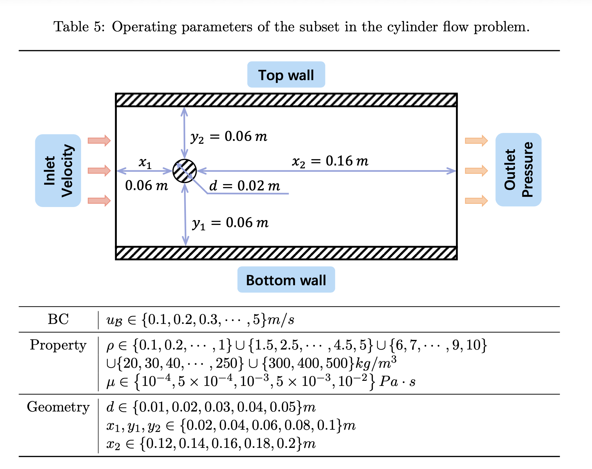

# CFDBench — 圆柱绕流与 Kármán 涡街（Cylinder Flow）



**描述：** 流体从左侧进入含固定圆柱障碍物的二维通道，在适当 Reynolds 数下发生边界层分离和周期涡脱落；数据分别改变入口速度、密度/黏度和圆柱/外域几何。 圆柱绕流是研究钝体尾迹、边界层分离和 Kármán 涡街的经典问题。CFDBench 将物性组合筛选到论文所述 $20\le\mathrm{{Re}}\le1000$，覆盖从较平稳尾迹到显著周期涡脱落的状态。该问题拥有 205,620 帧，占整个 CFDBench 约 68.2%，也是最适合评估长时自回归误差累积和周期结构学习的一类。

- 所属数据集： **CFDBench**
- 数据集作者：Yining Luo、Yingfa Chen、Zhen Zhang
- 生成软件：ANSYS Fluent 2021R1；需要时使用 SST $k$--$\omega$ 湍流闭合
- 官方 loader：[`src/dataset/cylinder.py`](https://github.com/luo-yining/CFDBench/blob/main/src/dataset/cylinder.py)

## 控制方程

论文为四类问题统一写出二维不可压缩牛顿流体 Navier--Stokes 方程。守恒形式为

$$
\nabla\cdot(\rho\mathbf u)=0,
$$

$$
\frac{\partial(\rho\mathbf u)}{\partial t}
+\nabla\cdot(\rho\mathbf u\otimes\mathbf u)
=-\nabla p
+\nabla\cdot\left\{\mu\left[\nabla\mathbf u+(\nabla\mathbf u)^{\mathsf T}\right]\right\}
+\rho\mathbf g,
$$

其中 $\mathbf u=(u,v)^{\mathsf T}$，$u$、$v$ 分别是 $x$、$y$ 方向速度，$p$ 是压力，$\rho$ 是密度，$\mu$ 是动力黏度。除 dam 问题外，可取 $\mathbf g=\mathbf 0$。在 $\rho$、$\mu$ 为常数时，二维分量形式为

$$
\frac{\partial u}{\partial x}+\frac{\partial v}{\partial y}=0,
$$

$$
\frac{\partial u}{\partial t}
+u\frac{\partial u}{\partial x}
+v\frac{\partial u}{\partial y}
=-\frac{1}{\rho}\frac{\partial p}{\partial x}
+\frac{\mu}{\rho}\left(
\frac{\partial^2u}{\partial x^2}+\frac{\partial^2u}{\partial y^2}
\right)+g_x,
$$

$$
\frac{\partial v}{\partial t}
+u\frac{\partial v}{\partial x}
+v\frac{\partial v}{\partial y}
=-\frac{1}{\rho}\frac{\partial p}{\partial y}
+\frac{\mu}{\rho}\left(
\frac{\partial^2v}{\partial x^2}+\frac{\partial^2v}{\partial y^2}
\right)+g_y.
$$

> **方程范围说明。** 论文正文逐式写出的数学系统是上述不可压缩 Navier--Stokes 方程。Tube 和 Dam 的 Fluent 配置还使用 VOF 两相模型；Cylinder 的部分工况使用 SST $k$--$\omega$ 湍流闭合。论文没有完整列出 VOF 或 SST 的附加输运方程及模型常数。

论文没有列出 SST $k$--$\omega$ 的完整附加输运方程和常数；$k,\omega$ 也不是官方插值数据的标签通道。

## 物理区域、坐标与边界条件

$x$ 沿来流方向由左向右，$y$ 为横向。左侧为速度入口，右侧为压力出口，上下为无滑移壁面，域内圆柱为固定无滑移障碍物。

论文用 $x_1,x_2,y_1,y_2$ 表示圆柱中心到左、右、下、上边界的距离，并用 $d$ 表示圆柱几何尺度。若把圆心置于原点，外域可表为

$$
D_\mathrm{{outer}}=[-x_1,x_2]\times[-y_1,y_2],
$$

再去除圆柱内部。边界条件为

$$
\mathbf u(-x_1,y,t)=(u_\mathrm{{in}},0),
$$

$$
p(x_2,y,t)=p_\mathrm{{out}},
$$

上下壁面和圆柱表面满足 $\mathbf u=\mathbf0$。

## 关于数据

| 项目 | 数值或说明 |
|---|---|
| 空间维数 | 2D |
| 流动特征 | 单相绕流、分离、尾迹、周期涡脱落 |
| 原始插值尺寸 | `u.npy`, `v.npy`: $(T_i,64,64)$ |
| 当前修正版 loader | `load_case_data_fix` 在同一网格生成圆柱/边界 mask，约为 $(T_i,3,64,64)$ |
| 旧代码路径 | 文件中仍保留过 padding 的旧函数/注释，部分辅助工具可能假设 $66\times65$ |
| 工况向量 | 8 维：`vel_in,density,viscosity,height,width,center_x,center_y,radius` |
| 轨迹/case | 185 = 50 BC + 115 PROP + 20 GEO |
| 总帧数 | 205,620 |
| 平均帧数 | 1,111.46，仅为平均值 |
| 时间间隔 | 论文和自回归 loader：$0.001\,\mathrm s$；非自回归类中存在 $0.1\,\mathrm s$ 元数据 |
| 统一 $t_{\mathrm{max}}$ | 未可靠统一；从 case 数组和正确的时间元数据恢复 |
| 论文每帧原始量 | 约 4.4 MB |
| 论文生成时间 | 约 1.18 s/帧 |
| 当前压缩包 | `cylinder/` 约 12 GB：BC 2.94 GB、GEO 2.41 GB、PROP 6.67 GB（2026-07-21） |

## 基准工况

$$
\rho=10\,\mathrm{{kg\,m^{{-3}}}},\qquad
\mu=10^{{-3}}\,\mathrm{{Pa\,s}},\qquad
u_\mathrm{{in}}=1\,\mathrm{{m/s}},
$$

$$
d=0.02\,\mathrm m,
$$

$$
x_1=y_1=y_2=0.06\,\mathrm m,
\qquad x_2=0.16\,\mathrm m.
$$

论文按

$$
\mathrm{{Re}}=\frac{{\rho u_\mathrm{{in}}d}}{{\mu}}
$$

筛选 PROP 工况，使其落在 $[20,1000]$。

## 参数

数据按互斥子集分别生成：每个子集只改变一类工况，其余固定为上一节的基准工况。取值来自论文表 5。

| 子集 | cases | 扫描参数与取值 | 固定（基准） |
|---|---:|---|---|
| BC | 50 | $u_{\mathrm{in}}=u_{\mathcal{B}}\in\{0.1,0.2,0.3,\ldots,5\}\,\mathrm{m/s}$（步长 $0.1$） | $\rho=10\,\mathrm{kg\,m^{-3}}$，$\mu=10^{-3}\,\mathrm{Pa\cdot s}$，$d=0.02\,\mathrm{m}$，$x_1=y_1=y_2=0.06\,\mathrm{m}$，$x_2=0.16\,\mathrm{m}$ |
| PROP | 115 | $\rho\in\{0.1,0.2,\ldots,1\}\cup\{1.5,2.5,\ldots,4.5,5\}\cup\{6,7,\ldots,10\}\cup\{20,30,\ldots,250\}\cup\{300,400,500\}\,\mathrm{kg\,m^{-3}}$；$\mu\in\{10^{-4},5\times10^{-4},10^{-3},5\times10^{-3},10^{-2}\}\,\mathrm{Pa\cdot s}$；仅保留 $\mathrm{Re}\in[20,1000]$ 的组合（非整网格） | $u_{\mathrm{in}}=1\,\mathrm{m/s}$，$d=0.02\,\mathrm{m}$，$x_1=y_1=y_2=0.06\,\mathrm{m}$，$x_2=0.16\,\mathrm{m}$ |
| GEO | 20 | $d\in\{0.01,0.02,0.03,0.04,0.05\}\,\mathrm{m}$；$x_1,y_1,y_2\in\{0.02,0.04,0.06,0.08,0.1\}\,\mathrm{m}$；$x_2\in\{0.12,0.14,0.16,0.18,0.2\}\,\mathrm{m}$（正文另写圆柱尺度集合，并混用 $d$/radius 命名） | $u_{\mathrm{in}}=1\,\mathrm{m/s}$，$\rho=10\,\mathrm{kg\,m^{-3}}$，$\mu=10^{-3}\,\mathrm{Pa\cdot s}$ |

> GEO 与 PROP 均非整笛卡尔积；直径/半径命名冲突以 `case.json` 与 mask 几何为准。

## 数值生成设置

- 生成软件：ANSYS Fluent 2021R1；网格生成与批处理脚本位于仓库 `generation-code/`，其中包括 ICEM RPL 和 Fluent Scheme 文件。
- 层流/湍流：层流工况采用 laminar model；需要湍流闭合时采用 SST $k$--$\omega$。
- 压力--速度耦合：单相流采用 Coupled Scheme；两相流采用 SIMPLE。
- 空间离散：压力方程二阶插值；VOF 使用 PRESTO!；动量方程二阶迎风。
- 时间离散：一阶隐式。
- 插值：最小二乘；最终发布数据映射到 $64\times64$ 笛卡尔网格。
- 近壁面网格：第一层网格尺度加密至约 $10^{-5}\,\mathrm m$。
- 收敛：论文给出的全局残差收敛阈值为 $10^{-9}$；最终速度残差至少达到约 $10^{-6}$ 量级。
- 生成硬件：AMD Ryzen Threadripper 3990X，30 个 solver processes。
- 数值精度：论文未明确说明单精度或双精度；不要仅根据 NumPy 文件 dtype 反推 Fluent 求解精度。

## 学习任务、输入与输出

CFDBench 同时支持两种问题定义。

### 非自回归坐标查询

$$
\widehat{q}(x,y,t)=f_\theta\big((x,y,t),\Omega\big),
$$

其中 $\Omega$ 是边界、物性和几何条件。论文中的 FFN/DeepONet 实验通常在查询点预测一个标量速度分量；磁盘上仍保存两个速度分量 $u,v$。

### 自回归场推进

$$
\widehat{\mathbf u}^{\,n+1}
=f_\theta\big(\mathbf u^n,\Omega,\mathrm{mask}\big).
$$

典型输入是当前帧的二维速度场、工况向量和几何/边界 mask，标签是下一时刻的 $u,v$。官方代码把 `u`、`v`、`mask` 堆叠为 `(T,3,H,W)` 的特征，但 mask 是静态条件而不是守恒物理量，不应与速度通道采用同一归一化策略。

### 数据划分

论文对每个基础子集按 case 进行 8:1:1 的训练/验证/测试划分。同一条轨迹的帧不会跨 split，从而保证测试工况在训练时不可见。若要严格复现，需固定代码版本、随机种子以及最终生成的 case 列表。

## 下载与目录组织

### 官方链接

- 论文：[https://arxiv.org/abs/2310.05963](https://arxiv.org/abs/2310.05963)
- 官方代码：[https://github.com/luo-yining/CFDBench](https://github.com/luo-yining/CFDBench)
- 插值数据：[https://huggingface.co/datasets/chen-yingfa/CFDBench](https://huggingface.co/datasets/chen-yingfa/CFDBench)
- 原始 Fluent 数据：[https://huggingface.co/datasets/chen-yingfa/CFDBench-raw](https://huggingface.co/datasets/chen-yingfa/CFDBench-raw)
- 百度网盘原始数据：[https://pan.baidu.com/s/1p0q60cv2hFZ7UcIf3XKSaw?pwd=cfd4](https://pan.baidu.com/s/1p0q60cv2hFZ7UcIf3XKSaw?pwd=cfd4)，提取码 `cfd4`

官方仓库把插值数据描述为约 13.4 GB；Hugging Face 页面在 **2026-07-21** 显示总文件大小为约 14.4 GB。原始库在仓库 README 中被描述为约 460 GB，而 Hugging Face 原始页当前显示约 205 GB，并注明 Cylinder 部分仍在上传。对可复现工作，应记录具体下载日期和仓库 revision。

### 命令行下载

先安装当前 Hugging Face CLI：

```bash
python -m pip install -U huggingface_hub
```

完整下载插值库：

```bash
hf download chen-yingfa/CFDBench \
  --repo-type dataset \
  --local-dir ./downloads/CFDBench
```

完整下载原始库会占用数百 GB，执行前建议先检查：

```bash
hf download chen-yingfa/CFDBench-raw \
  --repo-type dataset \
  --local-dir ./downloads/CFDBench-raw \
  --dry-run
```

### 代码仓库

```bash
git clone https://github.com/luo-yining/CFDBench.git
cd CFDBench
python -m pip install -r requirements.txt
```

解压后的推荐目录结构为

```text
data/
├── cavity/
│   ├── bc/caseXXXX/{case.json,u.npy,v.npy}
│   ├── geo/caseXXXX/{case.json,u.npy,v.npy}
│   └── prop/caseXXXX/{case.json,u.npy,v.npy}
├── tube/
├── dam/
└── cylinder/
```

### 只下载本问题

```bash
hf download chen-yingfa/CFDBench \\
  cylinder/bc.zip cylinder/geo.zip cylinder/prop.zip \\
  --repo-type dataset \\
  --local-dir ./downloads/CFDBench

mkdir -p ./data/cylinder
unzip ./downloads/CFDBench/cylinder/bc.zip   -d ./data/cylinder
unzip ./downloads/CFDBench/cylinder/geo.zip  -d ./data/cylinder
unzip ./downloads/CFDBench/cylinder/prop.zip -d ./data/cylinder
```

## 有趣且具有挑战性的方面

- Kármán 涡街具有明显周期性和相位敏感性，适合检验频域模型和长期滚动预测。
- 障碍物引起的边界层分离与尾迹结构需要同时解析局部高梯度和全局相干结构。
- 轨迹最长、帧数最多，误差累积问题最突出。
- PROP 不是全笛卡尔积，而是由 Reynolds 数筛选出的不规则参数子域。
- GEO 的圆柱和外域几何需要 mask 与标量参数共同表达。

## 已知注意事项

- **时间间隔冲突：** 论文/自回归类为 $0.001\,\mathrm s$，当前非自回归类仍有 $0.1\,\mathrm s$。这可能代表下采样或遗留元数据，必须在训练前核验。
- **loader 代码漂移：** `cylinder.py` 中保留多版加载函数；当前类调用 `load_case_data_fix`，但其他工具可能仍假定旧 padding 尺寸。建议固定 commit 并运行 shape 单元测试。
- **直径/半径命名冲突：** 以真实 `case.json` 和 mask 几何为准。
- 原始 Fluent 可含压力和速度模；插值标签仍统一为 $u,v$。

## 原始出处定位

- 论文：第 3.1、3.5 节，表 5、表 6，第 3.6 节，附录 E.1。
- 代码：`src/dataset/cylinder.py`，Cylinder 对应 Fluent Scheme。
