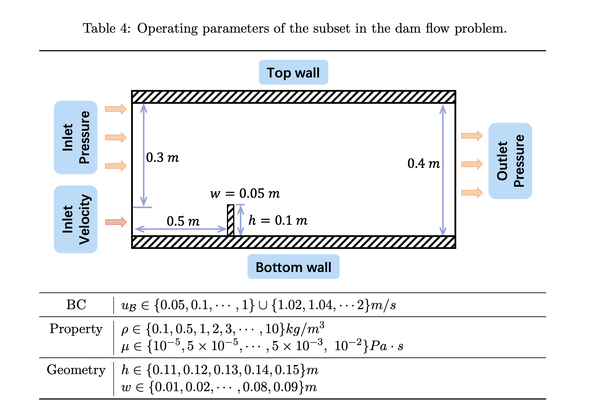

# CFDBench — 带障碍物的重力两相越障流（Dam Flow）



**描述：** 水从左侧低位速度入口进入含空气的矩形域，越过固定竖直障碍物后在重力作用下形成射流、回流和壁面冲击；数据分别扫描入口速度、密度/黏度和障碍物几何。 论文把复杂的溃坝/越坝过程简化为二维水--空气流越过一个竖直台阶。低 Reynolds 数时黏性作用明显，流体沿障碍物下落；入口速度增大后惯性增强，形成越障射流并在重力作用下撞击底壁。该问题包含源项、两相界面、混合入口边界和显式障碍物，是四类数据中生成单帧最慢的一类。

- 所属数据集： **CFDBench**
- 数据集作者：Yining Luo、Yingfa Chen、Zhen Zhang
- 生成软件：ANSYS Fluent 2021R1，VOF + 重力
- 官方 loader：[`src/dataset/dam.py`](https://github.com/luo-yining/CFDBench/blob/main/src/dataset/dam.py)

## 控制方程

论文为四类问题统一写出二维不可压缩牛顿流体 Navier--Stokes 方程。守恒形式为

$$
\nabla\cdot(\rho\mathbf u)=0,
$$

$$
\frac{\partial(\rho\mathbf u)}{\partial t}
+\nabla\cdot(\rho\mathbf u\otimes\mathbf u)
=-\nabla p
+\nabla\cdot\left\{\mu\left[\nabla\mathbf u+(\nabla\mathbf u)^{\mathsf T}\right]\right\}
+\rho\mathbf g,
$$

其中 $\mathbf u=(u,v)^{\mathsf T}$，$u$、$v$ 分别是 $x$、$y$ 方向速度，$p$ 是压力，$\rho$ 是密度，$\mu$ 是动力黏度。除 dam 问题外，可取 $\mathbf g=\mathbf 0$。在 $\rho$、$\mu$ 为常数时，二维分量形式为

$$
\frac{\partial u}{\partial x}+\frac{\partial v}{\partial y}=0,
$$

$$
\frac{\partial u}{\partial t}
+u\frac{\partial u}{\partial x}
+v\frac{\partial u}{\partial y}
=-\frac{1}{\rho}\frac{\partial p}{\partial x}
+\frac{\mu}{\rho}\left(
\frac{\partial^2u}{\partial x^2}+\frac{\partial^2u}{\partial y^2}
\right)+g_x,
$$

$$
\frac{\partial v}{\partial t}
+u\frac{\partial v}{\partial x}
+v\frac{\partial v}{\partial y}
=-\frac{1}{\rho}\frac{\partial p}{\partial y}
+\frac{\mu}{\rho}\left(
\frac{\partial^2v}{\partial x^2}+\frac{\partial^2v}{\partial y^2}
\right)+g_y.
$$

> **方程范围说明。** 论文正文逐式写出的数学系统是上述不可压缩 Navier--Stokes 方程。Tube 和 Dam 的 Fluent 配置还使用 VOF 两相模型；Cylinder 的部分工况使用 SST $k$--$\omega$ 湍流闭合。论文没有完整列出 VOF 或 SST 的附加输运方程及模型常数。

对于本问题，$\mathbf g=(0,-g)^{\mathsf T}$。Fluent 还求解 VOF 相体积分数；标准无质量传递形式可写为

$$
\frac{\partial\alpha}{\partial t}+\nabla\cdot(\alpha\mathbf u)=0,
$$

但 $\alpha$ 不是官方插值压缩包中的统一输出标签。

## 物理区域、坐标与边界条件

外域长 $1.5\,\mathrm m$、高 $0.4\,\mathrm m$，$x$ 向右，$y$ 向上，重力向下。左侧靠近底部的 $0.1\,\mathrm m$ 段为速度入口；其上方 $0.3\,\mathrm m$ 段为压力入口；右侧为压力出口；上下为壁面。竖直障碍物左缘距入口 $0.5\,\mathrm m$，障碍物高度和宽度为 $h,w$。

简化边界表达为

$$
\mathbf u(0,y,t)=(u_\mathrm{{in}},0)
\quad\text{{on the lower inlet segment}},
$$

$$
p=p_\mathrm{{in}}
\quad\text{{on the upper-left pressure inlet}},
\qquad
p=p_\mathrm{{out}}
\quad\text{{on the right outlet}},
$$

固体壁面和障碍物采用无滑移条件。

## 关于数据

| 项目 | 数值或说明 |
|---|---|
| 空间维数 | 2D |
| 相态与源项 | 水--空气 VOF；重力 $-y$ |
| 外域 | $1.5\,\mathrm m\times0.4\,\mathrm m$ |
| 原始插值尺寸 | `u.npy`, `v.npy`: $(T_i,64,64)$ |
| 当前 loader 特征 | 约 $(T_i,3,66,65)$，通道 $(u,v,\mathrm{{mask}})$；补左入口列和上下壁面行 |
| 几何表达 | 障碍物由 mask 表达；当前五维条件向量保留的是外域 `height/width`，不是障碍物 $h,w$ |
| 轨迹/case | 220 = 70 BC + 100 PROP + 50 GEO |
| 总帧数 | 21,916 |
| 平均帧数 | 99.62，仅为平均值 |
| 时间间隔 | $\Delta t=0.1\,\mathrm s$ |
| 统一 $t_{\mathrm{max}}$ | 未给出；由每条数组长度确定 |
| 论文每帧原始量 | 约 2.0 MB |
| 论文生成时间 | 约 3.98 s/帧 |
| 当前压缩包 | `dam.zip`，约 1.35 GB（2026-07-21） |

## 基准工况

$$
\rho=100\,\mathrm{{kg\,m^{{-3}}}},\qquad
\mu=0.1\,\mathrm{{Pa\,s}},\qquad
u_\mathrm{{in}}=1\,\mathrm{{m/s}},
$$

$$
h=0.1\,\mathrm m,\qquad
w=0.05\,\mathrm m,
$$

$$
L_x=1.5\,\mathrm m,\qquad L_y=0.4\,\mathrm m.
$$

当前 loader 的条件键顺序为

```text
[velocity, density, viscosity, height, width]
```

其中 `height=0.4`、`width=1.5` 是外域尺寸；GEO 子集变化的障碍物几何主要通过 mask 进入模型。

## 参数

数据按互斥子集分别生成：每个子集只改变一类工况，其余固定为上一节的基准工况。取值来自论文表 4；外域固定为 $1.5\,\mathrm{m}\times0.4\,\mathrm{m}$。

| 子集 | cases | 扫描参数与取值 | 固定（基准） |
|---|---:|---|---|
| BC | 70 | $u_{\mathrm{in}}=u_{\mathcal{B}}\in\{0.05,0.1,\ldots,1\}\cup\{1.02,1.04,\ldots,2\}\,\mathrm{m/s}$（前段步长 $0.05$，后段步长 $0.02$） | $\rho=100\,\mathrm{kg\,m^{-3}}$，$\mu=0.1\,\mathrm{Pa\cdot s}$，$h=0.1\,\mathrm{m}$，$w=0.05\,\mathrm{m}$ |
| PROP | 100 | 表 4：$\rho\in\{0.1,0.5,1,2,3,\ldots,10\}\,\mathrm{kg\,m^{-3}}$；$\mu\in\{10^{-5},5\times10^{-5},\ldots,5\times10^{-3},10^{-2}\}\,\mathrm{Pa\cdot s}$ | $u_{\mathrm{in}}=1\,\mathrm{m/s}$，$h=0.1\,\mathrm{m}$，$w=0.05\,\mathrm{m}$ |
| GEO | 50 | $h\in\{0.11,0.12,0.13,0.14,0.15\}\,\mathrm{m}$；$w\in\{0.01,0.02,\ldots,0.09\}\,\mathrm{m}$（$5\times10=50$） | $u_{\mathrm{in}}=1\,\mathrm{m/s}$，$\rho=100\,\mathrm{kg\,m^{-3}}$，$\mu=0.1\,\mathrm{Pa\cdot s}$ |

> 正文对 Dam PROP 误抄了 Tube 的 $\rho,\mu$ 叙述（并误指向表 3），与表 4 不一致；上表以表 4 为准。实际 case 列表仍应以发布元数据核对。

## 数值生成设置

- 生成软件：ANSYS Fluent 2021R1；网格生成与批处理脚本位于仓库 `generation-code/`，其中包括 ICEM RPL 和 Fluent Scheme 文件。
- 层流/湍流：层流工况采用 laminar model；需要湍流闭合时采用 SST $k$--$\omega$。
- 压力--速度耦合：单相流采用 Coupled Scheme；两相流采用 SIMPLE。
- 空间离散：压力方程二阶插值；VOF 使用 PRESTO!；动量方程二阶迎风。
- 时间离散：一阶隐式。
- 插值：最小二乘；最终发布数据映射到 $64\times64$ 笛卡尔网格。
- 近壁面网格：第一层网格尺度加密至约 $10^{-5}\,\mathrm m$。
- 收敛：论文给出的全局残差收敛阈值为 $10^{-9}$；最终速度残差至少达到约 $10^{-6}$ 量级。
- 生成硬件：AMD Ryzen Threadripper 3990X，30 个 solver processes。
- 数值精度：论文未明确说明单精度或双精度；不要仅根据 NumPy 文件 dtype 反推 Fluent 求解精度。

## 学习任务、输入与输出

CFDBench 同时支持两种问题定义。

### 非自回归坐标查询

$$
\widehat{q}(x,y,t)=f_\theta\big((x,y,t),\Omega\big),
$$

其中 $\Omega$ 是边界、物性和几何条件。论文中的 FFN/DeepONet 实验通常在查询点预测一个标量速度分量；磁盘上仍保存两个速度分量 $u,v$。

### 自回归场推进

$$
\widehat{\mathbf u}^{\,n+1}
=f_\theta\big(\mathbf u^n,\Omega,\mathrm{mask}\big).
$$

典型输入是当前帧的二维速度场、工况向量和几何/边界 mask，标签是下一时刻的 $u,v$。官方代码把 `u`、`v`、`mask` 堆叠为 `(T,3,H,W)` 的特征，但 mask 是静态条件而不是守恒物理量，不应与速度通道采用同一归一化策略。

### 数据划分

论文对每个基础子集按 case 进行 8:1:1 的训练/验证/测试划分。同一条轨迹的帧不会跨 split，从而保证测试工况在训练时不可见。若要严格复现，需固定代码版本、随机种子以及最终生成的 case 列表。

## 下载与目录组织

### 官方链接

- 论文：[https://arxiv.org/abs/2310.05963](https://arxiv.org/abs/2310.05963)
- 官方代码：[https://github.com/luo-yining/CFDBench](https://github.com/luo-yining/CFDBench)
- 插值数据：[https://huggingface.co/datasets/chen-yingfa/CFDBench](https://huggingface.co/datasets/chen-yingfa/CFDBench)
- 原始 Fluent 数据：[https://huggingface.co/datasets/chen-yingfa/CFDBench-raw](https://huggingface.co/datasets/chen-yingfa/CFDBench-raw)
- 百度网盘原始数据：[https://pan.baidu.com/s/1p0q60cv2hFZ7UcIf3XKSaw?pwd=cfd4](https://pan.baidu.com/s/1p0q60cv2hFZ7UcIf3XKSaw?pwd=cfd4)，提取码 `cfd4`

官方仓库把插值数据描述为约 13.4 GB；Hugging Face 页面在 **2026-07-21** 显示总文件大小为约 14.4 GB。原始库在仓库 README 中被描述为约 460 GB，而 Hugging Face 原始页当前显示约 205 GB，并注明 Cylinder 部分仍在上传。对可复现工作，应记录具体下载日期和仓库 revision。

### 命令行下载

先安装当前 Hugging Face CLI：

```bash
python -m pip install -U huggingface_hub
```

完整下载插值库：

```bash
hf download chen-yingfa/CFDBench \
  --repo-type dataset \
  --local-dir ./downloads/CFDBench
```

完整下载原始库会占用数百 GB，执行前建议先检查：

```bash
hf download chen-yingfa/CFDBench-raw \
  --repo-type dataset \
  --local-dir ./downloads/CFDBench-raw \
  --dry-run
```

### 代码仓库

```bash
git clone https://github.com/luo-yining/CFDBench.git
cd CFDBench
python -m pip install -r requirements.txt
```

解压后的推荐目录结构为

```text
data/
├── cavity/
│   ├── bc/caseXXXX/{case.json,u.npy,v.npy}
│   ├── geo/caseXXXX/{case.json,u.npy,v.npy}
│   └── prop/caseXXXX/{case.json,u.npy,v.npy}
├── tube/
├── dam/
└── cylinder/
```

### 只下载本问题

```bash
hf download chen-yingfa/CFDBench dam.zip \\
  --repo-type dataset \\
  --local-dir ./downloads/CFDBench
unzip ./downloads/CFDBench/dam.zip -d ./data
```

## 有趣且具有挑战性的方面

- 同时包含重力源项、VOF 界面、射流、回流和固体障碍物。
- 障碍物尺寸改变会导致几何拓扑相同但局部可通行区域和碰撞位置显著变化。
- GEO 条件主要靠空间 mask，而当前标量条件向量没有显式保留障碍物 $h,w$。
- 总帧数较少、轨迹较短，但每帧 Fluent 生成时间在四类问题中最高。

## 已知注意事项

- PROP 和 GEO 数量存在论文内部矛盾；不要从表格自行恢复 case 列表。
- 当前 loader 的 `height,width` 是外域尺寸，不能误读为论文 GEO 中的障碍物高宽。
- 插值数组是 $64\times64$，而 loader padding 后可能是 $66\times65$。
- 原始数据可含 VOF 和压力；插值 benchmark 的统一标签仍是 $u,v$。

## 原始出处定位

- 论文：第 3.1、3.4 节，表 4、表 6，第 3.6 节，附录 E.1。
- 代码：`src/dataset/dam.py`，Dam 对应 Fluent Scheme。
