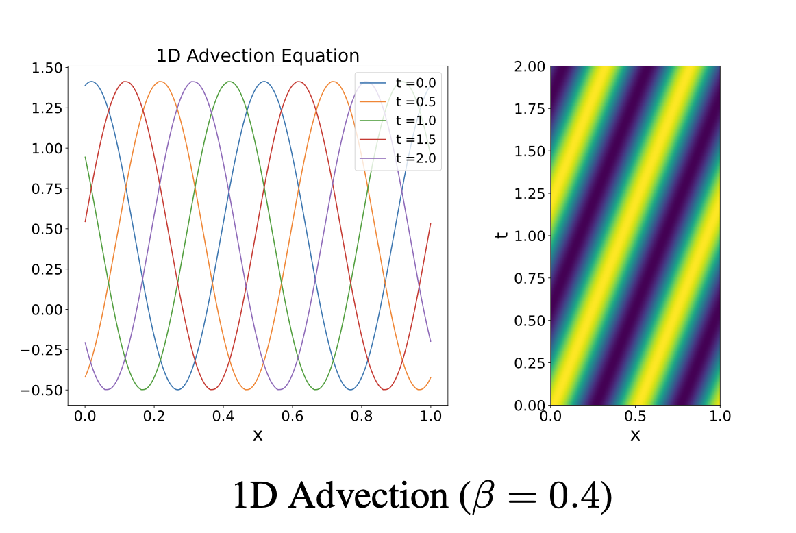

# 一维线性平流方程

平流方程刻画不含非线性的纯平流过程：标量场以常速度 $\beta$ 平移，精确解即为初值的平移 $u(t,x)=u_0(x-\beta t)$。它把平移、相位保持与参数条件化从扩散和非线性效应中单独分离出来。



## 所属数据集与访问方式

| 字段 | 内容 |
|---|---|
| 所属数据集 | **PDEBench** |
| 数据集论文 | [PDEBench: An Extensive Benchmark for Scientific Machine Learning](https://arxiv.org/abs/2210.07182) |
| 论文 PDF | [arXiv PDF](https://arxiv.org/pdf/2210.07182) |
| 官方代码库 | [pdebench/PDEBench](https://github.com/pdebench/PDEBench) |
| 数据 DOI / DaRUS | [10.18419/darus-2986](https://doi.org/10.18419/darus-2986) |
| 当前下载类别 | `advection` |
| 数据量 | 47 GB |
| 生成代码入口 | [data_gen_NLE/AdvectionEq](https://github.com/pdebench/PDEBench/tree/main/pdebench/data_gen/data_gen_NLE/AdvectionEq) |
| 文档核对日期 | 2026-07-21 |

## 控制方程

\[
\partial_t u(t,x)+\beta\,\partial_x u(t,x)=0,\qquad x\in(0,1),\quad t\in(0,2],
\]
\[
u(0,x)=u_0(x),\qquad u(t,x)=u_0(x-\beta t).
\]

## 变量与坐标

**状态变量**
- $u(t,x)$：被输运的标量场。

**参数**
- $\beta$：常数平流速度。

**坐标与定义域**
- 空间：一维均匀笛卡尔坐标 $x\in(0,1)$，域长 $L_x=1$。
- 时间：$t\in(0,2]$（含初值时常用闭区间 $[0,2]$）。
- 解析解：$u(t,x)=u_0(x-\beta t)$。

## 关于数据

| 属性 | 内容 |
|---|---|
| 空间维数 | 1 |
| 含时间 | 是 |
| 网格 | 均匀一维笛卡尔 |
| 空间域 | $x\in(0,1)$ |
| 时间范围 | $t\in[0,2]$ |
| 空间分辨率 | $N_x=1024$ |
| 时间点数 | 201 |
| 每文件轨迹数 | 10,000 |
| 通道 | 1：$u$ |
| 单样本形状 | $201\times1024\times1$ |
| 数据量 | 47 GB |
| 格式 | HDF5 |

## 初始条件

初值为随机正弦波叠加
\[
u_0(x)=\sum_{i=1}^{N}A_i\sin(k_i x+\phi_i),\qquad k_i=2\pi n_i/L_x.
\]
其中 $n_i$ 在 $[1,n_{\max}]$ 中随机选取。1D-advection 取 $N=2$、$n_{\max}=8$（论文写作 $k_{\max}=8$）、$A_i\sim\mathcal U(0,1)$、$\phi_i$ 在 $(0,2\pi)$ 随机。生成后，带随机符号的绝对值操作与 window function 各以 10% 概率施加。

## 边界条件

周期边界条件。

## 数值生成方法

时间和空间均采用二阶迎风有限差分。

## 参数

| 参数 | 变化方式 | 取值 |
|---|---|---|
| $\beta$（平流速度） | 不同 HDF5 文件不同 | $\{0.1,0.2,0.4,0.7,1,2,4,7\}$（8 文件） |
| 初值 $n_i,A_i,\phi_i$ | 每轨迹随机 | $N=2$，$n_{\max}=8$，$A_i\sim\mathcal U(0,1)$，$\phi_i\in(0,2\pi)$ |
| abs / window | 每轨迹随机（各约 10%） | 带随机符号的绝对值；window function |
| 边界、域、网格、时间、数值格式 | 固定 | 周期；$x\in(0,1)$；$N_x=1024$；$t\in[0,2]$；时空二阶迎风 |

## 论文配置

当前训练清单含 8 个 `1D_Advection_Sols_beta*.hdf5` 文件；每个文件固定一个 $\beta$，内部含 10,000 条不同初值轨迹。

## 数据文件

当前官方下载清单（`pdebench_data_urls.csv`）共 **8** 个文件；相对路径相对于下载根目录。详见 [数据格式](../00_data_format/)。

- `1D/Advection/Train/1D_Advection_Sols_beta0.1.hdf5`
- `1D/Advection/Train/1D_Advection_Sols_beta0.2.hdf5`
- `1D/Advection/Train/1D_Advection_Sols_beta0.4.hdf5`
- `1D/Advection/Train/1D_Advection_Sols_beta0.7.hdf5`
- `1D/Advection/Train/1D_Advection_Sols_beta1.0.hdf5`
- `1D/Advection/Train/1D_Advection_Sols_beta2.0.hdf5`
- `1D/Advection/Train/1D_Advection_Sols_beta4.0.hdf5`
- `1D/Advection/Train/1D_Advection_Sols_beta7.0.hdf5`

## 数据布局与机器学习输入输出

完整轨迹为标量序列。典型动力学任务为 $u_{t-\ell:t-1}\mapsto u_t$ 或多步 rollout；也可把 $\beta$ 作为显式条件做跨参数训练。

- **轨迹与训练样本：** 完整 HDF5 轨迹不是固定的模型输入。自回归训练通常从完整轨迹切出 $\ell$ 帧输入与下一帧/未来多帧目标；$\ell$ 由训练配置的 `initial_step` 决定。
- **版本优先级：** 方程与初边值以论文为准；文件数、分辨率、轨迹数与通道以当前可下载 HDF5 / 官方清单为准。

## 下载

官方仓库当前推荐 `download_direct.py`，而不是较慢且可能报错的 EasyDataverse 路径。

```bash
git clone https://github.com/pdebench/PDEBench.git
cd PDEBench/pdebench/data_download
python download_direct.py --root_folder /path/to/pdebench_data --pde_name advection
```

也可以从 [DaRUS DOI 页面](https://doi.org/10.18419/darus-2986) 手动选择文件。下载后应逐文件检查 HDF5 的实际 `shape`、坐标数组、变量键和 YAML attributes，尤其不要仅凭文件名推断 CFD/不可压 NS 的空间分辨率。

## 从官方代码重新生成

```bash
cd PDEBench/pdebench/data_gen/data_gen_NLE/AdvectionEq
CUDA_VISIBLE_DEVICES=0 python3 advection_multi_solution_Hydra.py +multi=beta1e0.yaml
# all configured training parameters
bash run_trainset.sh
cd ..
python Data_Merge.py
```

生成器参数可通过对应 Hydra YAML 修改。对 NLE 路径生成的 `.npy` 数据，需要执行 `Data_Merge.py` 才能得到官方 dataloader 使用的 HDF5 布局。

## 数据的兴趣点与挑战

相位误差会在长时间滚动中累积；速度改变会直接改变每步平移量，因此适合测试参数条件化、时间外推与频率保持。

## 主要来源

- [PDEBench 论文与补充材料](https://arxiv.org/abs/2210.07182)
- [PDEBench 官方代码库](https://github.com/pdebench/PDEBench)
- [官方下载说明](https://github.com/pdebench/PDEBench/tree/main/pdebench/data_download)
- [PDEBench 数据集 DOI](https://doi.org/10.18419/darus-2986)
