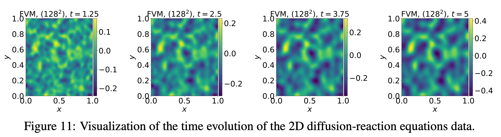

# 二维 FitzHugh–Nagumo 扩散—反应系统

二维扩散—反应系统在激活子与抑制子两个非线性耦合场上演化，反应项取 FitzHugh–Nagumo 形式，主要用于生物图样形成。不同扩散率、双通道耦合与无流边界使其成为多场动力学的代表性基准。



## 所属数据集与访问方式

| 字段 | 内容 |
|---|---|
| 所属数据集 | **PDEBench** |
| 数据集论文 | [PDEBench: An Extensive Benchmark for Scientific Machine Learning](https://arxiv.org/abs/2210.07182) |
| 论文 PDF | [arXiv PDF](https://arxiv.org/pdf/2210.07182) |
| 官方代码库 | [pdebench/PDEBench](https://github.com/pdebench/PDEBench) |
| 数据 DOI / DaRUS | [10.18419/darus-2986](https://doi.org/10.18419/darus-2986) |
| 当前下载类别 | `2d_reacdiff` |
| 数据量 | 13 GB |
| 生成代码入口 | [gen_diff_react.py + configs/diff-react.yaml](https://github.com/pdebench/PDEBench/blob/main/pdebench/data_gen/gen_diff_react.py) |
| 文档核对日期 | 2026-07-21 |

## 控制方程

\[
\partial_tu=D_u(\partial_{xx}u+\partial_{yy}u)+R_u(u,v),\qquad
\partial_tv=D_v(\partial_{xx}v+\partial_{yy}v)+R_v(u,v),
\]
\[
R_u=u-u^3-k-v,\qquad R_v=u-v.
\]

## 变量与坐标

**状态变量**
- $u(t,x,y)$：activator（激活子）。
- $v(t,x,y)$：inhibitor（抑制子）。

**参数与反应项**
- $D_u,D_v$：激活子 / 抑制子扩散系数（论文取 $D_u=10^{-3}$，$D_v=5\times10^{-3}$）。
- $R_u(u,v)=u-u^3-k-v$，$R_v(u,v)=u-v$：FitzHugh–Nagumo 反应函数。
- $k$：反应参数（论文取 $5\times10^{-3}$）。

**坐标与定义域**
- 空间：二维均匀笛卡尔坐标，$(x,y)\in(-1,1)^2$。
- 时间：$t\in(0,5]$。

## 关于数据

| 属性 | 内容 |
|---|---|
| 空间维数 | 2 |
| 含时间 | 是 |
| 网格 | 均匀二维有限体积 |
| 空间域 | $(x,y)\in(-1,1)^2$ |
| 时间范围 | $t\in[0,5]$ |
| 空间分辨率 | 训练 $128\times128$；原始 $512\times512$ |
| 时间点数 | 训练 101；原始 501 |
| 每文件轨迹数 | 1,000 |
| 通道 | 2：$u$（activator）、$v$（inhibitor） |
| 单样本形状 | $101\times128\times128\times2$ |
| 数据量 | 13 GB |
| 格式 | HDF5 |

## 初始条件

论文明确给出 activator 的标准正态随机噪声 $u(0,x,y)\sim\mathcal N(0,1)$。该段没有单独写出 inhibitor 初值的完整采样公式，因此不可仅据论文文字臆测；实际使用应检查 HDF5 两个变量与生成器。

## 边界条件

无流 Neumann 边界：$D_u\partial_nu=0$、$D_v\partial_nv=0$。论文逐坐标写成 $D_u\partial_xu=D_v\partial_xv=D_u\partial_yu=D_v\partial_yv=0$。

## 数值生成方法

空间有限体积法；论文称四阶 Runge–Kutta，当前 YAML metadata 标为 RK45。当前配置：`Du=1e-3, Dv=5e-3, k=5e-3, t=5, tdim=101, xdim=ydim=128`。

## 参数

| 参数 | 变化方式 | 取值 |
|---|---|---|
| $D_u,D_v,k$ | 固定 | $D_u=10^{-3}$，$D_v=5\times10^{-3}$，$k=5\times10^{-3}$；文件名 `NA_NA` |
| 初值噪声 seed | 每轨迹随机 | activator：$u(0)\sim\mathcal N(0,1)$ |
| 边界、域、网格、时间 | 固定 | Neumann；$(-1,1)^2$；训练 $128^2$ |

## 论文配置

一个主要论文文件 `2D_diff-react_NA_NA.h5`，1,000 条双通道轨迹。

## 数据文件

当前官方下载清单（`pdebench_data_urls.csv`）共 **1** 个文件；相对路径相对于下载根目录。详见 [数据格式](../00_data_format/)。

- `2D/diffusion-reaction/2D_diff-react_NA_NA.h5`

## 数据布局与机器学习输入输出

多通道轨迹预测：$[u,v]_{t-\ell:t-1}\mapsto[u,v]_t$。两个场不应被当作可互换图像通道，因为反应函数中的角色不同。

- **轨迹与训练样本：** 完整 HDF5 轨迹不是固定的模型输入。自回归训练通常从完整轨迹切出 $\ell$ 帧输入与下一帧/未来多帧目标；$\ell$ 由训练配置的 `initial_step` 决定。
- **版本优先级：** 方程与初边值以论文为准；文件数、分辨率、轨迹数与通道以当前可下载 HDF5 / 官方清单为准。

## 下载

官方仓库当前推荐 `download_direct.py`，而不是较慢且可能报错的 EasyDataverse 路径。

```bash
git clone https://github.com/pdebench/PDEBench.git
cd PDEBench/pdebench/data_download
python download_direct.py --root_folder /path/to/pdebench_data --pde_name 2d_reacdiff
```

也可以从 [DaRUS DOI 页面](https://doi.org/10.18419/darus-2986) 手动选择文件。下载后应逐文件检查 HDF5 的实际 `shape`、坐标数组、变量键和 YAML attributes，尤其不要仅凭文件名推断 CFD/不可压 NS 的空间分辨率。

## 从官方代码重新生成

```bash
cd PDEBench
python -m pdebench.data_gen.gen_diff_react
# Hydra configuration: pdebench/data_gen/configs/diff-react.yaml
```

生成器参数可通过对应 Hydra YAML 修改；该路径直接写出 HDF5，无需执行 `Data_Merge.py`。

## 数据的兴趣点与挑战

双场非线性耦合、不同扩散尺度、图样形成、高频随机初值、Neumann 边界和分辨率下采样误差。

## 主要来源

- [PDEBench 论文与补充材料](https://arxiv.org/abs/2210.07182)
- [PDEBench 官方代码库](https://github.com/pdebench/PDEBench)
- [官方下载说明](https://github.com/pdebench/PDEBench/tree/main/pdebench/data_download)
- [PDEBench 数据集 DOI](https://doi.org/10.18419/darus-2986)
