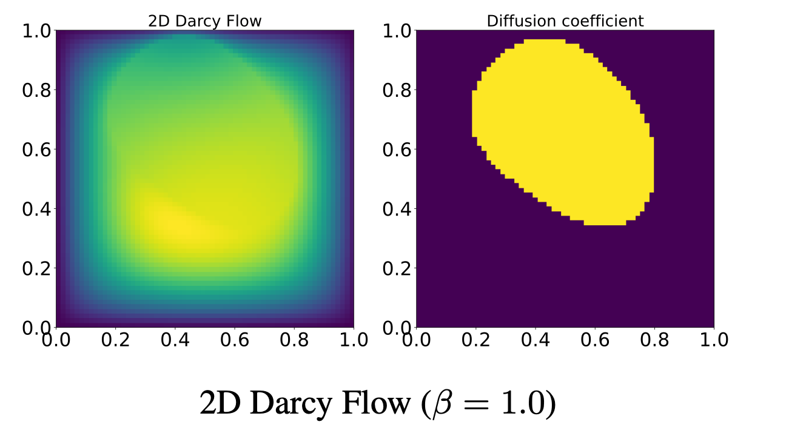

# 二维 Darcy Flow

Darcy Flow 是时间无关的稳态算子学习任务：由空间变化的系数场 $a(x)$ 映射到零 Dirichlet 边界下的稳态解 $u(x)$。常值力项 $\beta$ 改变解的尺度，系数场 realization 改变空间结构。



## 所属数据集与访问方式

| 字段 | 内容 |
|---|---|
| 所属数据集 | **PDEBench** |
| 数据集论文 | [PDEBench: An Extensive Benchmark for Scientific Machine Learning](https://arxiv.org/abs/2210.07182) |
| 论文 PDF | [arXiv PDF](https://arxiv.org/pdf/2210.07182) |
| 官方代码库 | [pdebench/PDEBench](https://github.com/pdebench/PDEBench) |
| 数据 DOI / DaRUS | [10.18419/darus-2986](https://doi.org/10.18419/darus-2986) |
| 当前下载类别 | `darcy` |
| 数据量 | 6.2 GB |
| 生成代码入口 | [ReactionDiffusionEq/run_DarcyFlow2D.sh](https://github.com/pdebench/PDEBench/blob/main/pdebench/data_gen/data_gen_NLE/ReactionDiffusionEq/run_DarcyFlow2D.sh) |
| 文档核对日期 | 2026-07-21 |

## 控制方程

\[
-\nabla\!\cdot\!\bigl(a(\mathbf x)\nabla u(\mathbf x)\bigr)=f(\mathbf x),\qquad \mathbf x\in(0,1)^2,
\]
\[
u(\mathbf x)=0\quad\text{on }\partial(0,1)^2,\qquad f(\mathbf x)=\beta.
\]

## 变量与坐标

**场变量**
- $a(\mathbf{x})$：空间变化的扩散 / 渗透系数场（论文称 viscosity term）；算子任务的输入。
- $u(\mathbf{x})$：稳态解；算子任务的输出。
- $f(\mathbf{x})$：外力项；论文中取空间常数 $f=\beta$。

**参数**
- $\beta$：常数 forcing，控制解的尺度。

**坐标与定义域**
- 空间：二维均匀笛卡尔坐标，$\mathbf{x}\in(0,1)^2$。
- 时间：论文任务为稳态映射，无时间维；生成时可暂态积分至稳态。

## 关于数据

| 属性 | 内容 |
|---|---|
| 空间维数 | 2 |
| 含时间 | 否（稳态） |
| 网格 | 均匀二维笛卡尔 |
| 空间域 | $(0,1)^2$ |
| 时间范围 | — |
| 空间分辨率 | $128\times128$ |
| 时间点数 | 1（稳态） |
| 每文件样本数 | 10,000 |
| 通道 | 2：输入 $a$、输出 $u$ |
| 单样本形状 | $128\times128\times2$ |
| 数据量 | 6.2 GB |
| 格式 | HDF5 |

## 初始条件

系数场 $a(x,y)$ 随样本变化。为得到稳态，代码从随机场暂态初值积分 $\partial_tu-\nabla\cdot(a\nabla u)=f$ 直至收敛；暂态初值不是最终 operator-learning 输入。

## 边界条件

稳态解使用齐次 Dirichlet 边界 $u=0$。

## 数值生成方法

论文通过暂态扩散方程求稳态，并说明数值计算与一维 diffusion–reaction 的扩散部分相同。生成脚本位于 `ReactionDiffusionEq` 目录，随后用 `Data_Merge.py` 转为 HDF5。

## 参数

| 参数 | 变化方式 | 取值 |
|---|---|---|
| $\beta$（常值外力 $f=\beta$） | 不同 HDF5 文件不同 | $\beta\in\{0.01,0.1,1,10,100\}$（5 文件） |
| 系数场 $a(x,y)$ | 每样本随机 | 空间变化扩散系数 realization |
| 边界、域、分辨率、稳态设定 | 固定 | $u=0$ Dirichlet；$(0,1)^2$；$128^2$ |

## 论文配置

5 个 `2D_DarcyFlow_beta*_Train.hdf5` 参数文件，每文件 10,000 个系数场—解对。

## 数据文件

当前官方下载清单（`pdebench_data_urls.csv`）共 **5** 个文件；相对路径相对于下载根目录。详见 [数据格式](../00_data_format/)。

- `2D/DarcyFlow/2D_DarcyFlow_beta0.01_Train.hdf5`
- `2D/DarcyFlow/2D_DarcyFlow_beta0.1_Train.hdf5`
- `2D/DarcyFlow/2D_DarcyFlow_beta1.0_Train.hdf5`
- `2D/DarcyFlow/2D_DarcyFlow_beta10.0_Train.hdf5`
- `2D/DarcyFlow/2D_DarcyFlow_beta100.0_Train.hdf5`

## 数据布局与机器学习输入输出

静态算子任务 $a(x,y)\mapsto u(x,y)$；不要把它误写成 2 通道随时间共同演化。$\beta$ 可作为额外标量条件。

- **轨迹与训练样本：** 完整 HDF5 轨迹不是固定的模型输入。自回归训练通常从完整轨迹切出 $\ell$ 帧输入与下一帧/未来多帧目标；$\ell$ 由训练配置的 `initial_step` 决定。
- **版本优先级：** 方程与初边值以论文为准；文件数、分辨率、轨迹数与通道以当前可下载 HDF5 / 官方清单为准。

## 下载

官方仓库当前推荐 `download_direct.py`，而不是较慢且可能报错的 EasyDataverse 路径。

```bash
git clone https://github.com/pdebench/PDEBench.git
cd PDEBench/pdebench/data_download
python download_direct.py --root_folder /path/to/pdebench_data --pde_name darcy
```

也可以从 [DaRUS DOI 页面](https://doi.org/10.18419/darus-2986) 手动选择文件。下载后应逐文件检查 HDF5 的实际 `shape`、坐标数组、变量键和 YAML attributes，尤其不要仅凭文件名推断 CFD/不可压 NS 的空间分辨率。

## 从官方代码重新生成

```bash
cd PDEBench
bash pdebench/data_gen/data_gen_NLE/ReactionDiffusionEq/run_DarcyFlow2D.sh
# set type: ReacDiff and dim: 2 in data_gen_NLE/config/config.yaml
python pdebench/data_gen/data_gen_NLE/Data_Merge.py
```

生成器参数可通过对应 Hydra YAML 修改。对 NLE 路径生成的 `.npy` 数据，需要执行 `Data_Merge.py` 才能得到官方 dataloader 使用的 HDF5 布局。

## 数据的兴趣点与挑战

空间异质系数、椭圆全局依赖、不同 forcing 尺度，以及输入场到输出场而非状态推进的任务差异。

## 主要来源

- [PDEBench 论文与补充材料](https://arxiv.org/abs/2210.07182)
- [PDEBench 官方代码库](https://github.com/pdebench/PDEBench)
- [官方下载说明](https://github.com/pdebench/PDEBench/tree/main/pdebench/data_download)
- [PDEBench 数据集 DOI](https://doi.org/10.18419/darus-2986)
