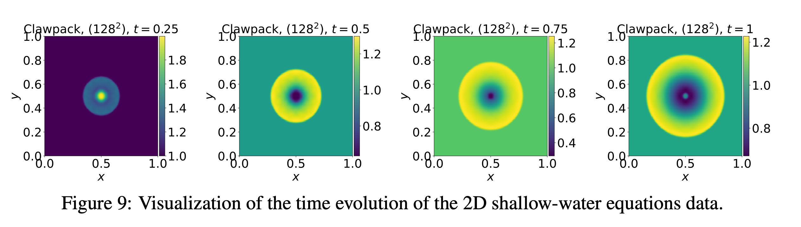

# 二维浅水方程：径向溃坝

浅水方程由 Navier–Stokes 导出，用于自由表面流动，在二维下守恒水深与两个方向的动量，并可跨越解中的冲击。PDEBench 以径向溃坝作为代表性场景，考察重力驱动的水面波传播。



## 所属数据集与访问方式

| 字段 | 内容 |
|---|---|
| 所属数据集 | **PDEBench** |
| 数据集论文 | [PDEBench: An Extensive Benchmark for Scientific Machine Learning](https://arxiv.org/abs/2210.07182) |
| 论文 PDF | [arXiv PDF](https://arxiv.org/pdf/2210.07182) |
| 官方代码库 | [pdebench/PDEBench](https://github.com/pdebench/PDEBench) |
| 数据 DOI / DaRUS | [10.18419/darus-2986](https://doi.org/10.18419/darus-2986) |
| 当前下载类别 | `swe` |
| 数据量 | 6.2 GB |
| 生成代码入口 | [gen_radial_dam_break.py + radial_dam_break.yaml](https://github.com/pdebench/PDEBench/blob/main/pdebench/data_gen/gen_radial_dam_break.py) |
| 文档核对日期 | 2026-07-21 |

## 控制方程

\[
\partial_th+\partial_x(hu)+\partial_y(hv)=0,
\]
\[
\partial_t(hu)+\partial_x\!\left(u^2h+\tfrac12g_rh^2\right)+\partial_y(uvh)=-g_rh\,\partial_xb,
\]
\[
\partial_t(hv)+\partial_y\!\left(v^2h+\tfrac12g_rh^2\right)+\partial_x(uvh)=-g_rh\,\partial_yb.
\]

## 变量与坐标

**状态变量**
- $h(t,x,y)$：水深。
- $u(t,x,y),\,v(t,x,y)$：水平与竖直方向速度。
- $hu,\,hv$：方向动量分量。

**几何与参数**
- $b(x,y)$：bathymetry（底地形）。
- $g_r$：重力加速度。

**坐标与定义域**
- 空间：二维均匀笛卡尔有限体积网格，$\Omega=[-2.5,2.5]^2$。
- 时间：论文轨迹常用 $t\in[0,1]$。
- 论文 benchmark 口径常只存 / 评测 $h$；完整守恒状态含 $h,hu,hv$。

## 关于数据

| 属性 | 内容 |
|---|---|
| 空间维数 | 2 |
| 含时间 | 是 |
| 网格 | 均匀二维有限体积 |
| 空间域 | $[-2.5,2.5]^2$ |
| 时间范围 | $[0,1]$ |
| 空间分辨率 | $128\times128$ |
| 时间点数 | 101 |
| 每文件轨迹数 | 1,000 |
| 通道 | 1：$h$（水深） |
| 单样本形状 | $101\times128\times128\times1$ |
| 数据量 | 6.2 GB |
| 格式 | HDF5 |

## 初始条件

径向溃坝初值
\[
h(0,x,y)=\begin{cases}2,&\sqrt{x^2+y^2}<r,\\1,&\sqrt{x^2+y^2}\ge r,\end{cases}
\qquad r\sim\mathcal U(0.3,0.7).
\]
圆心、内外水位在论文设置中固定，半径与 seed 逐轨迹变化。

## 边界条件

论文正文把该数据的边界概括为 Neumann 条件；特定 PyClaw 场景的完整边界实现应以生成器为准。

## 数值生成方法

PyClaw 有限体积法。当前 YAML：`T_end=1.0, n_time_steps=100, xdim=ydim=128, gravity=1.0, inner_height=2.0, domain=[-2.5,2.5]^2`；脚本对每个 seed 抽样 `dam_radius ~ U(0.3,0.7)`。

## 参数

| 参数 | 变化方式 | 取值 |
|---|---|---|
| 溃坝半径 $r$ | 每轨迹随机（发布数据中唯一可变物理量） | $r\sim\mathcal U(0.3,0.7)$；文件名 `NA_NA` |
| 圆心位置 | 固定 | 域中心 |
| 内外水深 | 固定 | 内 $h=2$，外 $h=1$ |
| 重力 $g_r$、底地形 $b$ | 固定 | $g_r=1.0$；$b$ 固定 |
| 边界、域、网格、时间 | 固定 | Neumann；$[-2.5,2.5]^2$；$128^2$；$t\in[0,1]$ |

## 论文配置

发布文件 `2D_rdb_NA_NA.h5`，含 1,000 条轨迹。生成脚本默认上限可能更大，勿与发布规模混淆。

## 数据文件

当前官方下载清单（`pdebench_data_urls.csv`）共 **1** 个文件；相对路径相对于下载根目录。详见 [数据格式](../00_data_format/)。

- `2D/shallow-water/2D_rdb_NA_NA.h5`

## 数据布局与机器学习输入输出

论文任务按水深单通道做时序预测。若重新生成并保存 $(h,hu,hv)$，必须标注为自定义三通道版本，不能与论文文件混为一谈。

- **轨迹与训练样本：** 完整 HDF5 轨迹不是固定的模型输入。自回归训练通常从完整轨迹切出 $\ell$ 帧输入与下一帧/未来多帧目标；$\ell$ 由训练配置的 `initial_step` 决定。
- **版本优先级：** 方程与初边值以论文为准；文件数、分辨率、轨迹数与通道以当前可下载 HDF5 / 官方清单为准。

## 下载

官方仓库当前推荐 `download_direct.py`，而不是较慢且可能报错的 EasyDataverse 路径。

```bash
git clone https://github.com/pdebench/PDEBench.git
cd PDEBench/pdebench/data_download
python download_direct.py --root_folder /path/to/pdebench_data --pde_name swe
```

也可以从 [DaRUS DOI 页面](https://doi.org/10.18419/darus-2986) 手动选择文件。下载后应逐文件检查 HDF5 的实际 `shape`、坐标数组、变量键和 YAML attributes，尤其不要仅凭文件名推断 CFD/不可压 NS 的空间分辨率。

## 从官方代码重新生成

```bash
cd PDEBench
python -m pdebench.data_gen.gen_radial_dam_break
# Hydra configuration: pdebench/data_gen/configs/radial_dam_break.yaml
```

生成器参数可通过对应 Hydra YAML 修改；该路径直接写出 HDF5，无需执行 `Data_Merge.py`。

## 数据的兴趣点与挑战

初始水深不连续、环形波传播、守恒律、非周期边界，以及“完整物理状态”和“论文单通道观测”之间的信息差。

## 主要来源

- [PDEBench 论文与补充材料](https://arxiv.org/abs/2210.07182)
- [PDEBench 官方代码库](https://github.com/pdebench/PDEBench)
- [官方下载说明](https://github.com/pdebench/PDEBench/tree/main/pdebench/data_download)
- [PDEBench 数据集 DOI](https://doi.org/10.18419/darus-2986)
